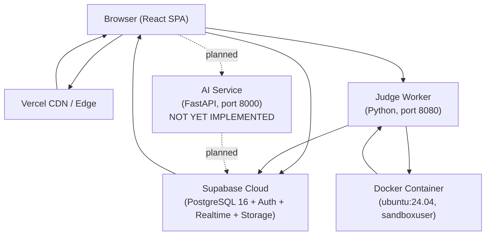

# 02 — Architecture

## High-Level System Architecture



---

## Data Flow Diagrams

### 1. Login Flow

```
User fills LoginView.tsx form
  -> useAuth.signInWithEmail()
    -> supabase.auth.signInWithPassword({ email, password })
      -> Supabase Auth JWT returned, stored in localStorage by Supabase SDK
        -> onAuthStateChange fires
          -> fetchProfile(userId) queries public.profiles + public.user_problem_progress
            -> setProfile() updates AuthContext
              -> ProtectedRoute allows access
                -> redirect to /app/dashboard
```

**GitHub OAuth:**
```
User clicks "Continue with GitHub"
  -> useAuth.signInWithGitHub()
    -> supabase.auth.signInWithOAuth({ provider: 'github', redirectTo: '/app/dashboard' })
      -> Browser redirected to GitHub OAuth consent
        -> On return, Supabase handles JWT exchange
          -> onAuthStateChange fires -> same fetchProfile flow
```

---

### 2. Code Submission Flow

```
User presses "Submit" in ProblemWorkspace.tsx
  -> submitSolution(problemId, code, language, userId, ...)
      called from frontend/src/lib/submissionService.ts line 228
    -> executeViaJudgeWorker() sends POST to http://JUDGE_WORKER_URL/execute
      Body: { execution_id, language, source_code, problem_id, is_custom_run: false, mode: "SUBMIT" }
      -> JudgeWorker (worker.py /execute handler, line 309):
        -> fetch_canonical_test_cases(problem_id) from Supabase using service_role key
        -> runner.execute(language, source_code, test_cases)
          -> inject_harness(language, source_code) wraps code in driver template
          -> tempfile.TemporaryDirectory() created (sandbox/scratch dir)
          -> subprocess.run(compile_cmd) compiles code (Java/C++)
          -> For each test_case:
              subprocess.Popen(run_cmd, stdin=tc.input, timeout=time_limit)
              compare_outputs(stdout, expected_output)
          -> ExecutionResult returned
        -> HTTP response with JSON result
      -> Frontend updateSubmissionState() notifies listeners
    -> Background: supabase.from('submissions').insert(result) (async, non-blocking)
    -> Background: if verdict==accepted, supabase.from('user_problem_progress').upsert(solved)
    -> TestCaseConsole.tsx renders verdict
```

---

### 3. AI Mentor Flow (PLANNED - NOT IMPLEMENTED)

```
User types question in AI Mentor chat panel
  -> POST http://AI_SERVICE_URL/mentor/chat
    -> FastAPI validates Supabase JWT
    -> pgvector similarity search on curriculum embeddings
    -> Compose Socratic prompt with context
    -> Stream tokens via SSE back to frontend
      -> Frontend renders streaming response
```

**Current state:** The AI service directory contains only requirements.txt and README.md. No source code exists.

---

### 4. Payment Flow (PLANNED - NOT IMPLEMENTED)

No payment code exists anywhere in the codebase. No pricing page, no checkout flow, no webhook handler.

---

### 5. Contest Participation Flow (PLANNED - NOT IMPLEMENTED)

App.tsx line 337-350 renders a WorkspaceSubView placeholder with message "Next scheduled algorithmic round will be announced in Phase 4."

---

## Folder-by-Folder Explanation

### frontend/src/App.tsx
The root router. Uses BrowserRouter + Routes. Defines 35 routes across Public, Protected, and Admin tiers. All protected routes are wrapped in ProtectedRoute (checks session + user). Admin routes wrapped in AdminRoute (additionally checks profile.role === 'admin').

### frontend/src/main.tsx
React entry point. Wraps App in:
- AuthProvider (useAuth context)
- ThemeProvider (useTheme context - dark/light toggle)
- ToastProvider (useToast context for notifications)

### frontend/src/components/
Design system and feature components organized by category:
- auth/: ProtectedRoute, AdminRoute
- authoring/: ProductionDashboardTab, AuthoringQueueTab
- dashboard/: ActiveSprintBanner, ProblemOfTheDayCard, CategoryProgressModule
- editor/: MonacoCodeEditor (thin wrapper around @monaco-editor/react)
- landing/: LandingHeader, LandingCockpitMockup
- learning/: DifficultyBadge
- planner/: SprintCard, RebalanceModal
- ui/: Full design system - Button, Input, Select, Card, Table, Badge, Tabs, Modal, Skeleton, ErrorState, Toast, Container, PageHeader, AppShell, AppLayout, PublicLayout, DashboardLayout, Navbar, Sidebar

### frontend/src/hooks/
- useAuth.tsx: AuthContext provider. Handles session, profile, signIn, signUp, OAuth, signOut, preferredLanguage, updatePreferredLanguage, updateProfile, updateCollege.
- useProblems.ts: Fetches all 3,392 problems in 4 parallel Supabase batches.
- useUserProgress.ts: Fetches user's solved/attempted/todo status and revision flags for problems.
- useUserTelemetry.ts: Tracks user activity streaks, daily solve counts.
- useRoadmap.ts: Fetches roadmap data from Supabase.
- useAutosave.ts: Debounced autosave for ProblemWorkspace code drafts.
- useSubmissionRealtime.ts: Subscribes to Supabase realtime channel for submission updates.
- useProblemBySlug.ts: Fetches full problem detail by slug.
- useTheme.tsx: Dark/light theme toggle with localStorage persistence.

### frontend/src/lib/
- supabaseClient.ts: Creates Supabase client. CRITICAL: URL and anon key hardcoded as fallback strings (lines 8 and 14).
- submissionService.ts: runCode() and submitSolution() functions; manages in-memory submission state and listeners; calls judge worker HTTP API; asynchronously persists to Supabase.
- draftService.ts: localStorage + Supabase cloud dual-layer draft persistence for problem workspace.
- ideDraftService.ts: localStorage-only draft persistence for standalone IDE.
- curriculumData.ts: Hardcoded FALLBACK_PROBLEMS array (used when Supabase unreachable).
- colleges.ts: SEEDED_COLLEGES array for campus league frontend calculations.
- utils.ts: cn() function (clsx + tailwind-merge).
- telemetryFeedback.ts: User activity telemetry helper.

### frontend/src/routes/
26 view files. Each is a full page component. See 03_frontend_pages.md for details.

### frontend/src/types/index.ts
620-line type definition file. All domain types: UserRole, DifficultyLevel, ProgrammingLanguage, SubmissionVerdict, Submission, Problem, UserProfile, Roadmap, StudySprint, SprintTask, RevisionCard, UserStudyPlan, UserCodespace, UserNote, College, LeaderboardEntry, etc.

---

## State Management Approach

- **Auth State:** React Context (AuthContext) provided by AuthProvider in main.tsx.
- **UI State:** Local useState hooks in each page component.
- **Server Data:** Fetched directly from Supabase in useEffect or custom hooks. No global state library (no Redux, Zustand, React Query).
- **Submission State:** In-memory Map in submissionService.ts (module-level singleton). Listeners are registered per submissionId.
- **Draft State:** localStorage (synchronous) + Supabase (async background).
- **Theme:** localStorage + React Context.

---

## Routing Structure

| Path | Component | Access |
|---|---|---|
| / | LandingView | Public |
| /foundation | FoundationView | Public |
| /architecture | ArchitectureView | Public |
| /roadmaps | RoadmapsView | Public |
| /roadmaps/:slug | RoadmapsView | Public |
| /problems | ProblemsView | Public |
| /problems/:slug | ProblemWorkspace | Public (with auth for submit) |
| /leaderboard | LeaderboardView | Public |
| /courses | CoursesView | Public |
| /ide | StandaloneIdeView | Public |
| /authoring | ProblemAuthoringView | Public (SECURITY ISSUE - should be admin-only) |
| /login | LoginView | Public |
| /register | RegisterView | Public |
| /forgot-password | ForgotPasswordView | Public |
| /app/authoring | ProblemAuthoringView | Protected (user) |
| /app/dashboard | DashboardView | Protected |
| /app/profile | ProfileView | Protected |
| /app/learn | WorkspaceSubView (placeholder) | Protected |
| /app/practice | WorkspaceSubView (placeholder) | Protected |
| /app/revision | RevisionView | Protected |
| /app/codespace | CodeSpaceView | Protected |
| /app/notespace | NoteSpaceView | Protected |
| /app/diagnostic | DiagnosticView | Protected |
| /app/plan | SprintPlanView | Protected |
| /app/sprint-plan | SprintPlanView | Protected |
| /app/study-plan | StudyPlanView | Protected |
| /app/contests | WorkspaceSubView (placeholder) | Protected |
| /app/projects | WorkspaceSubView (placeholder) | Protected |
| /app/ai-mentor | WorkspaceSubView (placeholder) | Protected |
| /app/settings | ProfileSettingsView | Protected |
| /app/admin | WorkspaceSubView (placeholder) | Admin |
| * | NotFoundView | Public |

---

## API Client Layer

The frontend has NO dedicated API client library (no axios, no @tanstack/query).

All data fetching uses:
1. **Supabase JS SDK** (supabase.from().select()/.insert()/.update()/.upsert()/.delete()) for all database operations.
2. **Fetch API** directly for calling the judge worker HTTP endpoints (/execute, /cancel).

Error handling is per-call try/catch with console.warn() fallbacks. No centralized error handling or retry logic.

---

## Error Handling Pattern

- Auth errors: returned as { error: Error | null } from useAuth methods.
- Supabase queries: try/catch blocks; on error, fallback to local data (curriculumData.ts, colleges.ts).
- Judge worker errors: fetch failure caught in executeViaJudgeWorker(); returns failedSub with verdict: 'internal_error' or 'cancelled'.
- UI errors: Toast notifications via useToast() hook.
- Global unhandled errors: No global error boundary configured.
