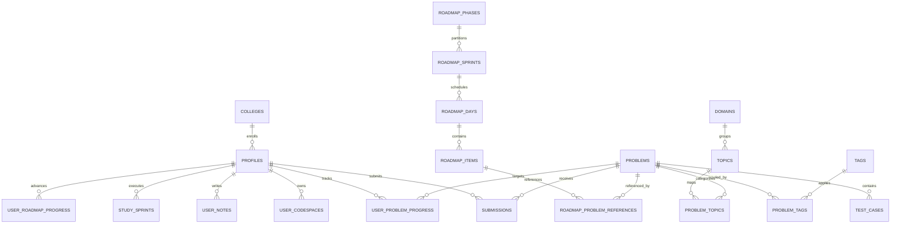

# 06 - Database Architecture & Schema Specification

## PostgreSQL Overview (Supabase)

VERNIQ uses a PostgreSQL 15+ database provisioned via Supabase. The database contains **39 relational tables**, **3 analytical views**, **5 system functions/triggers**, and strict Row-Level Security (RLS) policies across all publicly exposed user and problem tables.

---

## Migration Registry

The database schema is managed via 14 sequential SQL migrations located in `backend/supabase/migrations/`:

| Index | Migration Filename | Primary Domain / Purpose | Tables Created / Modified |
|---|---|---|---|
| `00` | `20261001000000_init_extensions_and_enums.sql` | PostgreSQL extensions (`uuid-ossp`, `pgcrypto`, `citext`) & system enums | System types, `handle_updated_at` |
| `01` | `20261001000001_create_user_profiles.sql` | User profiles, role enum (`student`, `mentor`, `admin`), triggers | `profiles` |
| `02` | `20261001000002_create_colleges_and_leaderboards.sql` | Indian universities/colleges, campus leagues, analytical views | `colleges`, 3 views |
| `03` | `20261001000003_create_curriculum_and_problems.sql` | Core curriculum, DSA problems, test cases, revision queue | `roadmaps`, `roadmap_steps`, `roadmap_topics`, `problems`, `tags`, `problem_tags`, `topic_problems`, `test_cases`, `user_problem_progress`, `user_revision_queue` |
| `04` | `20261001000004_create_submissions_and_judge_engine.sql` | Code submission records & completion trigger | `submissions` |
| `05` | `20261001000005_fix_citext_and_auth_trigger.sql` | Extension hardening & auth trigger idempotency | Triggers & function replacement |
| `06` | `20261001000006_add_preferred_language.sql` | Adds default language preference column to profiles | `profiles.preferred_language` |
| `07` | `20261001000007_create_study_planner.sql` | Custom study plans and user tasks | `user_study_plans`, `user_study_plan_tasks` |
| `08` | `20261001000008_adaptive_planner_engine.sql` | Diagnostic assessments, weekly sprints, daily tasks | `user_diagnostics`, `study_sprints`, `sprint_tasks` |
| `09` | `20261001000009_landing_and_mission_cockpit.sql` | Problem of the Day (POTD), Cloud CodeSpace, NoteSpace | `problem_of_the_day`, `user_codespaces`, `user_notes` |
| `10` | `20261001000010_problem_catalog_import.sql` | Taxonomy (domains, topics), problem source provenance, staging | `domains`, `topics`, `problem_topics`, `problem_sources`, `problem_import_batches`, `problem_import_staging` |
| `11` | `20261001000011_problem_content_authoring_pipeline.sql` | Editorial revisions, technical validation reviews | `problem_content_revisions`, `problem_technical_reviews` |
| `12` | `20261001000012_phase42_batch_authoring_pipeline.sql` | Multi-item batch generation & validation jobs | `problem_authoring_batches`, `batch_problem_items` |
| `13` | `20261001000013_roadmap_subsystem.sql` | Deep structured roadmaps (phases, sprints, days, items, progress) | `roadmap_phases`, `roadmap_sprints`, `roadmap_days`, `roadmap_day_topics`, `roadmap_items`, `roadmap_problem_references`, `user_roadmap_progress`, `user_roadmap_item_progress` |

---

## Entity-Relationship Diagram (Core Domains)

---

## Complete Table Specifications (By Functional Subsystem)

### Subsystem 1: Identity & Colleges
1. **`public.profiles`**
   - `id`: `UUID PRIMARY KEY REFERENCES auth.users(id) ON DELETE CASCADE`
   - `username`: `CITEXT UNIQUE NOT NULL`
   - `full_name`: `TEXT`
   - `avatar_url`: `TEXT`
   - `college_id`: `UUID REFERENCES public.colleges(id)`
   - `role`: `TEXT NOT NULL DEFAULT 'student' CHECK (role IN ('student', 'mentor', 'admin'))`
   - `problems_solved_count`: `INTEGER NOT NULL DEFAULT 0`
   - `score`: `INTEGER NOT NULL DEFAULT 0`
   - `current_streak`: `INTEGER NOT NULL DEFAULT 0`
   - `max_streak`: `INTEGER NOT NULL DEFAULT 0`
   - `preferred_language`: `TEXT DEFAULT 'python'`
   - `created_at`, `updated_at`: `TIMESTAMPTZ NOT NULL DEFAULT NOW()`
2. **`public.colleges`**
   - `id`: `UUID PRIMARY KEY DEFAULT gen_random_uuid()`
   - `name`: `TEXT UNIQUE NOT NULL`
   - `slug`: `TEXT UNIQUE NOT NULL`
   - `state`, `country`: `TEXT`
   - `student_count`: `INTEGER NOT NULL DEFAULT 0`
   - `total_score`: `BIGINT NOT NULL DEFAULT 0`
   - `created_at`: `TIMESTAMPTZ NOT NULL DEFAULT NOW()`

### Subsystem 2: Problems & Test Cases
3. **`public.problems`**
   - `id`: `UUID PRIMARY KEY DEFAULT gen_random_uuid()`
   - `slug`: `TEXT UNIQUE NOT NULL`
   - `title`: `TEXT NOT NULL`
   - `difficulty`: `TEXT NOT NULL CHECK (difficulty IN ('easy', 'medium', 'hard'))`
   - `description_markdown`: `TEXT NOT NULL`
   - `starter_templates`: `JSONB NOT NULL DEFAULT '{}'::jsonb`
   - `constraints`: `TEXT[]`
   - `hints`: `TEXT[]`
   - `acceptance_rate`: `NUMERIC(5,2) DEFAULT 0.00`
   - `total_submissions`: `INTEGER DEFAULT 0`
   - `total_accepted`: `INTEGER DEFAULT 0`
   - `is_premium`: `BOOLEAN DEFAULT FALSE`
   - `created_at`, `updated_at`: `TIMESTAMPTZ DEFAULT NOW()`
4. **`public.test_cases`**
   - `id`: `UUID PRIMARY KEY DEFAULT gen_random_uuid()`
   - `problem_id`: `UUID NOT NULL REFERENCES public.problems(id) ON DELETE CASCADE`
   - `input`: `TEXT NOT NULL`
   - `expected_output`: `TEXT NOT NULL`
   - `is_sample`: `BOOLEAN NOT NULL DEFAULT FALSE`
   - `ordinal`: `INTEGER NOT NULL DEFAULT 0`
   - `created_at`: `TIMESTAMPTZ DEFAULT NOW()`
5. **`public.tags`** & **`public.problem_tags`**
   - Normalised many-to-many tag relations (`id`, `name`, `slug`, `problem_id`, `tag_id`).

### Subsystem 3: Submissions & Progress
6. **`public.submissions`**
   - `id`: `UUID PRIMARY KEY DEFAULT gen_random_uuid()`
   - `user_id`: `UUID REFERENCES auth.users(id) ON DELETE SET NULL`
   - `problem_id`: `UUID NOT NULL REFERENCES public.problems(id) ON DELETE CASCADE`
   - `language`: `TEXT NOT NULL CHECK (language IN ('python', 'cpp', 'java', 'typescript', 'go'))`
   - `source_code`: `TEXT NOT NULL`
   - `verdict`: `TEXT NOT NULL DEFAULT 'pending' CHECK (verdict IN ('pending', 'running', 'accepted', 'wrong_answer', 'time_limit_exceeded', 'memory_limit_exceeded', 'compilation_error', 'runtime_error', 'internal_error', 'cancelled'))`
   - `runtime_ms`: `INTEGER`
   - `memory_kb`: `INTEGER`
   - `stdout_output`, `stderr_output`, `compile_output`: `TEXT`
   - `test_cases_passed`, `total_test_cases`: `INTEGER DEFAULT 0`
   - `is_custom_run`: `BOOLEAN DEFAULT FALSE`
   - `created_at`: `TIMESTAMPTZ DEFAULT NOW()`
   - `completed_at`: `TIMESTAMPTZ`
7. **`public.user_problem_progress`**
   - `user_id`: `UUID REFERENCES auth.users(id) ON DELETE CASCADE`
   - `problem_id`: `UUID REFERENCES public.problems(id) ON DELETE CASCADE`
   - `status`: `TEXT NOT NULL CHECK (status IN ('unsolved', 'attempted', 'solved'))`
   - `attempts_count`: `INTEGER DEFAULT 0`
   - `last_attempt_at`: `TIMESTAMPTZ`
   - `solved_at`: `TIMESTAMPTZ`
   - `PRIMARY KEY (user_id, problem_id)`
8. **`public.user_revision_queue`**
   - Tracks spaced repetition dates: `user_id`, `problem_id`, `box_level` (1-5), `next_review_at`.

### Subsystem 4: Sprints & Diagnostics
9. **`public.user_diagnostics`**: Stores diagnostic score, weak domains array, recommendation metadata.
10. **`public.study_sprints`**: Sprint duration (`week_number`, `start_date`, `end_date`), target problems count, status (`active`, `completed`).
11. **`public.sprint_tasks`**: Granular daily tasks linked to `study_sprints` and `problems`.
12. **`public.user_study_plans`** & **`user_study_plan_tasks`**: Legacy plan generator storage.

### Subsystem 5: Workspace Personal Vaults
13. **`public.problem_of_the_day`**: `date` (`DATE UNIQUE`), `problem_id`, `bonus_points`.
14. **`public.user_codespaces`**: Multi-file personal code vault: `user_id`, `title`, `language`, `files` (JSONB tree).
15. **`public.user_notes`**: Markdown notes attached to problems: `user_id`, `problem_id`, `content_markdown`.

### Subsystem 6: Taxonomy & Content Authoring
16. **`public.domains`**, **`public.topics`**, **`public.problem_topics`**, **`public.problem_sources`**: Taxonomy mapping for catalog.
17. **`public.problem_import_batches`**, **`public.problem_import_staging`**: Raw staging storage for problem scrapers and JSON seeders.
18. **`public.problem_content_revisions`**: Immutable revision log (`version`, `snapshot` JSONB, `author_id`, `status: draft | in_review | approved`).
19. **`public.problem_technical_reviews`**: Automated test suite evaluation records against solutions.
20. **`public.problem_authoring_batches`**, **`public.batch_problem_items`**: Phase 4.2 batch authoring queue and per-problem state machines.

### Subsystem 7: Hierarchical Roadmap Engine
21. **`public.roadmap_phases`**: High-level learning phases (e.g., "Foundations", "Core DSA", "Advanced Systems").
22. **`public.roadmap_sprints`**: Sprint schedules under phases.
23. **`public.roadmap_days`**: Daily learning checkpoints (Day 1..N).
24. **`public.roadmap_day_topics`**: Topics assigned per day.
25. **`public.roadmap_items`**: Atomic items (articles, exercises, quizzes).
26. **`public.roadmap_problem_references`**: Problem links with ordinal positions.
27. **`public.user_roadmap_progress`**, **`user_roadmap_item_progress`**: Granular user completion states.

---

## Row-Level Security (RLS) Policy Audit

Every table has RLS explicitly enabled via `ALTER TABLE ... ENABLE ROW LEVEL SECURITY;`.

### Key Policies in Plain English:
1. **`public.test_cases`**:
   - `CREATE POLICY "Public read sample test_cases only" ON public.test_cases FOR SELECT USING (is_sample = true);`
   - *Plain English:* Anonymous and standard authenticated users can ONLY query sample test cases (`is_sample = true`). Full canonical test suites are hidden from public queries and can only be accessed using the backend `service_role` key.
2. **`public.profiles`**:
   - Everyone can read basic profiles (`SELECT`).
   - Authenticated users can insert their own profile matching `auth.uid() = id`.
   - Users can update their own profile, but role escalation is blocked by `prevent_profile_role_update()` trigger.
3. **`public.submissions`**:
   - Users can only read submissions where `auth.uid() = user_id`.
   - Users can insert submissions where `auth.uid() = user_id`.
   - Update is restricted: only the judge worker (operating under `service_role`) can mutate execution results and verdicts.
4. **`public.user_codespaces` & `public.user_notes`**:
   - Strict owner-only access: `auth.uid() = user_id` for `SELECT`, `INSERT`, `UPDATE`, and `DELETE`.
5. **Authoring & Staging Tables (`problem_authoring_batches`, `problem_import_staging`)**:
   - Authenticated users can read and insert draft items; only reviews with approved status are publicly visible.

---

## Analytical Views

1. **`public.view_global_leaderboard`**:
   Ranks all users globally using `DENSE_RANK() OVER (ORDER BY score DESC, problems_solved_count DESC, created_at ASC)`.
2. **`public.view_college_leaderboard`**:
   Computes intra-college student rankings using `DENSE_RANK() OVER (PARTITION BY college_id ORDER BY score DESC, ...)`.
3. **`public.view_top_colleges`**:
   Ranks Indian engineering institutions by cumulative student points and active user count.

---

## Discrepancies & Code-vs-Database Gaps

1. **Missing Storage Buckets:** Frontend profile page references `avatar_url` uploads, but no storage bucket definitions (`avatars`, `submissions`) are configured in migrations.
2. **Mock vs Table Ingestion:** The frontend catalog loads 3,392 problems from `problems` table when connected, but falls back to static `curriculumData.ts` if Supabase connection fails.
3. **StudyPlan vs Adaptive Sprints:** There are two overlapping planner schemas: legacy `user_study_plans` (`20261001000007`) and adaptive `study_sprints` (`20261001000008`). The frontend predominantly interacts with `study_sprints`.
