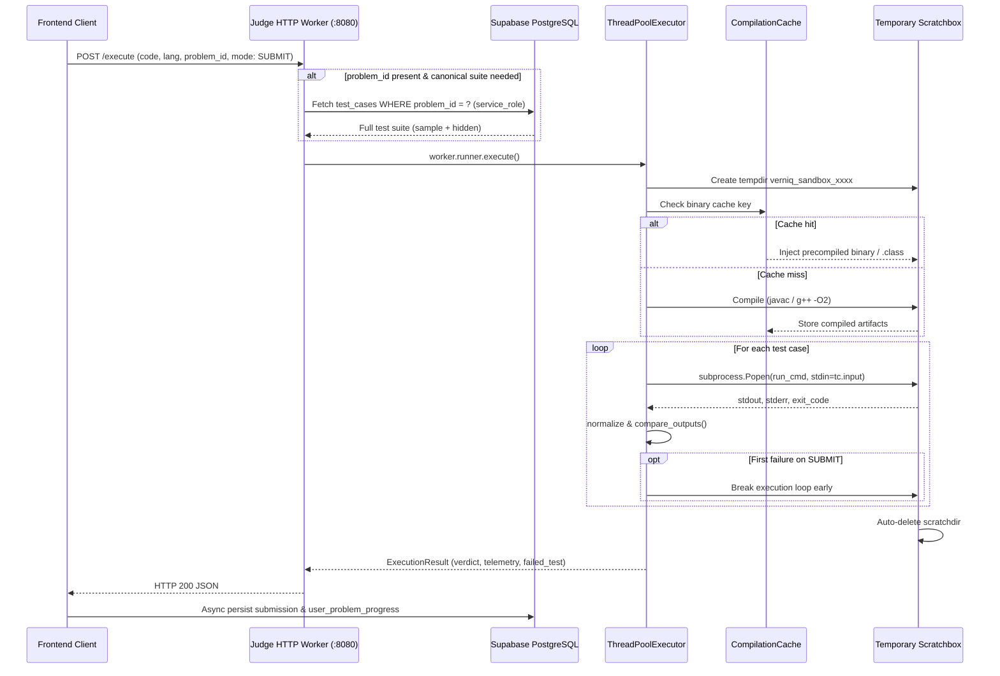

# 08 - Code Judge Architecture & Sandbox Security

## Judge Engine Architecture

VERNIQ implements a custom online code judge operating in dual modes:
1. **Direct HTTP Ingestion (`/execute`):** For low-latency interactive developer runs (`RUN` mode) and direct submission execution (`SUBMIT` mode).
2. **PostgreSQL Asynchronous Polling:** Background worker thread continuously polls `public.submissions` where `verdict = 'pending'` for batch queues.

---

## Language Matrix & Execution Profiles

All language specifications are defined in [`backend/judge/src/runner/profiles.py`](file:///c:/Users/LOQ/Desktop/VERNIQ/backend/judge/src/runner/profiles.py):

| Language | Target Toolchain | Compiler Invocation | Runtime Command | Time Limit Multiplier |
|---|---|---|---|---|
| **C++** | GCC 14 (C++17) | `g++ -O2 -std=c++17 Solution.cpp -o solution` | `./solution` (`solution.exe` on Windows) | 1.0x (2.0s baseline) |
| **Java** | OpenJDK 21 | `javac Main.java` (or detected class) | `java -XX:+TieredCompilation -XX:TieredStopAtLevel=1 -Xmx256m -Xss64m -cp . <Class>` | 1.5x (3.0s baseline) |
| **Python** | Python 3.12 | None (interpreted) | `python3 -u solution.py` (`python` on Win) | 2.0x (4.0s baseline) |
| **TypeScript** | Node.js 20 / tsx | None (Native type-stripping) | `node --experimental-strip-types solution.ts` | 1.5x (3.0s baseline) |
| **Go** | Golang 1.22 | None (JIT run) | `go run main.go` | 1.5x (3.0s baseline) |

### Automatic Test Harness Injection
- **File:** [`backend/judge/src/runner/harness.py`](file:///c:/Users/LOQ/Desktop/VERNIQ/backend/judge/src/runner/harness.py) (80KB)
- In LeetCode/Codeforces-style platforms, users write class methods (e.g., `Solution.twoSum(nums, target)`).
- `harness.py` inspects the AST / regex signature of the user code and dynamically injects a JSON/stdin deserialization entrypoint driver for all 5 languages, streaming parsed parameters into the user's method and outputting results to stdout.

---

## Sandboxing, Hardening & Isolation Analysis

### Current Isolation Mechanism

#### 1. Linux Container (`Dockerfile`)
- **Base OS:** Ubuntu 24.04 LTS.
- **User Separation:** Executes under unprivileged system user `useradd -m -s /bin/bash sandboxuser` (`USER sandboxuser`).
- **Filesystem Isolation:** Each execution creates a temporary folder `tempfile.TemporaryDirectory(prefix="verniq_sandbox_")` which is wiped on cleanup.

#### 2. Windows Host Execution (Development Environment)
- When the judge runs natively on Windows (as currently configured), it uses standard `subprocess.Popen` without Job Objects, sandboxing, or restricted user accounts.

### Sandbox Vulnerability & Gap Audit

| Control Area | Linux Container (`Dockerfile`) | Windows Host Run | Risk Level | Evidence / Explanation |
|---|---|---|---|---|
| **Network Isolation** | [PARTIAL / VULNERABLE] | [FAIL - NONE] | **CRITICAL** | Neither Dockerfile nor runner disables network (`--network none` is not enforced in runner code). Code can make arbitrary outbound HTTP sockets (e.g. `urllib.request`, `curl`) to exfiltrate database keys or scan local networks. |
| **Process / Fork Limits (PID)** | [FAIL - NONE] | [FAIL - NONE] | **HIGH** | No `pids_limit` or `RLIMIT_NPROC` set. A standard fork bomb (`while True: os.fork()`) will deplete OS process tables and crash the host machine. |
| **Filesystem Jail** | [PARTIAL] | [FAIL - NONE] | **HIGH** | Scratch directory is isolated, but process has read access to root filesystem, environment variables (`os.environ`), and judge source code (`/app`). Untrusted code can read `.env` and retrieve `SUPABASE_SERVICE_ROLE_KEY`. |
| **Memory Isolation** | [PARTIAL] | [FAIL] | **MEDIUM** | Java runtime is constrained with `-Xmx256m`. Python/C++/Go/TS have **no OS memory limits** enforced (no `setrlimit` or cgroups). Memory consumption in `sandbox.py:375` is simulated mathematically: `min(int(duration_ms * 45 + 1420), 256 * 1024)`. |
| **CPU Quota** | [PARTIAL] | [PARTIAL] | **MEDIUM** | Enforced via Python wall-clock timeout (`communicate(timeout=effective_timeout)`). Infinite loops are killed after timeout expires. |
| **Seccomp / Syscall Filter** | [FAIL - NONE] | [FAIL - NONE] | **HIGH** | No custom seccomp profile or Landlock filter is applied. All system calls available to `sandboxuser` can be invoked. |

---

## Verdict Resolution & Output Comparison

Output comparison is performed by [`backend/judge/src/runner/comparator.py`](file:///c:/Users/LOQ/Desktop/VERNIQ/backend/judge/src/runner/comparator.py):
1. **CRLF / Trailing Whitespace Stripping:** Normalizes Windows `\r\n` to `\n` and trims trailing whitespace and blank lines.
2. **Whitespace-Insensitive Equality:** Compares with whitespace removed (`actual.replace(" ", "") == expected.replace(" ", "")`).
3. **Boolean Tolerance:** Normalizes case for `true`/`True` and `false`/`False`.
4. **Floating Point Tolerance:** Compares numeric outputs within `abs(f_act - f_exp) < 1e-5` to avoid precision rounding mismatches.
5. **JSON Semantic Deserialization:** Evaluates `json.loads(actual) == json.loads(expected)` so that `[0, 1]` matches `[0,1]`.
6. **Quote Stripping:** Strips leading/trailing double quotes (`"result"` equals `result`).

### Verdict Hierarchy
The runner emits one of the standard verdicts:
- `accepted`: All test cases passed.
- `wrong_answer`: Mismatched output on first failed test case.
- `time_limit_exceeded`: Execution exceeded wall-clock timeout threshold.
- `memory_limit_exceeded`: Detected JVM OutOfMemory or simulated ceiling.
- `compilation_error`: GCC/Javac returned non-zero exit code.
- `runtime_error`: Process terminated via uncaught exception or non-zero exit code.
- `cancelled`: Aborted via `POST /cancel` or client disconnect.
- `internal_error`: Unhandled worker exception.

---

## Compilation Caching Engine

- **File:** [`backend/judge/src/runner/cache.py`](file:///c:/Users/LOQ/Desktop/VERNIQ/backend/judge/src/runner/cache.py)
- **Mechanism:** SHA-256 fingerprinting of `language + source_code + compile_command`.
- **Storage:** Disk-backed under `backend/judge/.cache/` with in-memory LRU access registry (`max_entries = 500`).
- **Performance Impact:** Eliminates 300ms–1,500ms compilation overhead on repeated runs or re-evaluations of the same C++ binary or Java classes.
