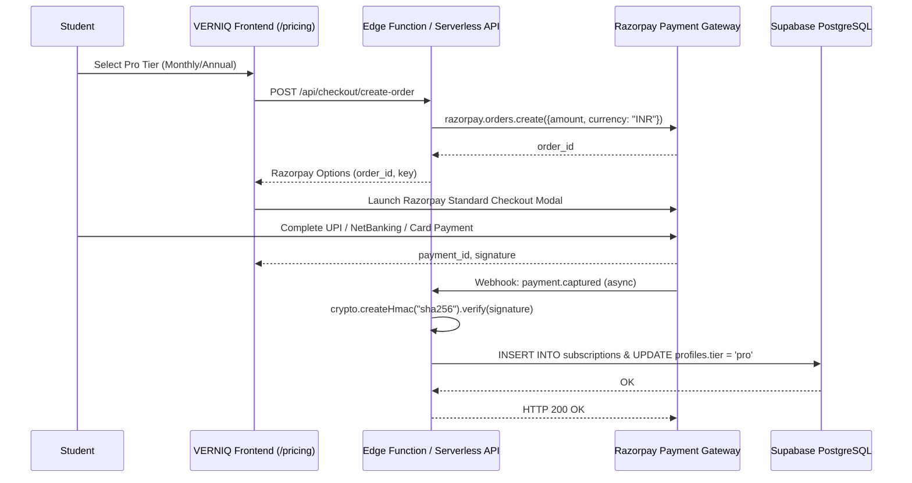

# 10 - Payments, Subscriptions & Monetization

## Current Operational Status: [PLANNED] (0% Implemented)

There is **zero payment processing infrastructure** implemented in the VERNIQ codebase.
No payment gateways (e.g. Razorpay, Stripe, Cashfree), pricing pages, checkout flows, webhook endpoints, or subscription tracking tables exist.

---

## Codebase Audit & Evidence

### 1. Dependency Analysis
A thorough audit of dependency manifests confirms that no payment SDKs are present:
- **`frontend/package.json`:** Does not include `razorpay`, `@stripe/stripe-js`, or `@stripe/react-stripe-js`.
- **`backend/judge/requirements.txt`:** No payment or cryptography packages.
- **`backend/ai/requirements.txt`:** No payment libraries.

### 2. Frontend Routing & UI
- **Route Audit:** [`frontend/src/routes/index.tsx`](file:///c:/Users/LOQ/Desktop/VERNIQ/frontend/src/routes/index.tsx) contains no route definitions for `/pricing`, `/checkout`, `/billing`, or `/subscription`.
- **Navigation:** The navigation components (`LandingHeader.tsx`, `DashboardSidebar.tsx`) do not link to any pricing or upgrade tiers.

### 3. Database Schema Audit
- **`problems.is_premium`:**
  - Located in [`backend/supabase/migrations/20261001000003_create_curriculum_and_problems.sql:67`](file:///c:/Users/LOQ/Desktop/VERNIQ/backend/supabase/migrations/20261001000003_create_curriculum_and_problems.sql#L67):
    ```sql
    is_premium BOOLEAN DEFAULT FALSE,
    ```
  - **Enforcement Status:** [DEAD COLUMN / UNENFORCED].
  - Frontend problem listing and Monaco editor allow all users to view, run, and submit code against any problem regardless of whether `is_premium` is `true` or `false`.
- **Missing Database Tables:**
  - No `subscriptions` table.
  - No `invoices` or `orders` table.
  - No `payment_transactions` table.
  - No customer ID column on `public.profiles` (`stripe_customer_id` or `razorpay_customer_id`).

---

## Planned Architecture & Technical Blueprint (Phase 12 Requirement)

To achieve production readiness for the Indian ed-tech market, the following architecture must be implemented:



### Necessary Architectural Components
1. **Gateway Recommendation:** **Razorpay** (essential for India: UPI auto-pay, RuPay cards, NetBanking, and corporate GST invoicing).
2. **Signature Verification & Idempotency:**
   - Webhook endpoint verifying `X-Razorpay-Signature` against `RAZORPAY_WEBHOOK_SECRET`.
   - Idempotency key tracking on `payment_id` to prevent duplicate crediting.
3. **Indian GST Compliance:**
   - 18% GST calculation on digital education services (SAC 9992).
   - Invoicing pipeline capturing user GSTIN and state of supply for CGST/SGST/IGST breakdown.
4. **Subscription State Machine:**
   - States: `active`, `past_due`, `cancelled`, `trialing`.
   - Grace period handling and automatic downgrade to free tier on billing failure.
