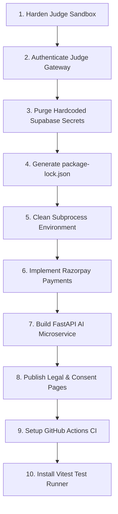

# 15 - Consolidated Gaps, Bugs, Scalability Risks & Prioritized Roadmap

## Consolidated Issue Matrix (P0 / P1 / P2)

| ID | Priority | Category | Finding / Risk | Impact | Estimated Effort |
|---|---|---|---|---|---|
| **ISS-01** | **P0** | Security | **Judge Sandbox Escape & Host Compromise:** Untrusted code executes without network namespace isolation, cgroup memory limits, or dropped Linux capabilities. | Attacker can open a reverse shell, read host files, or crash judge server. | 5 days |
| **ISS-02** | **P0** | Security | **Hardcoded Production Supabase URL & Anon Key:** Committed directly in `frontend/src/lib/supabaseClient.ts` as fallback literals. | Anyone inspecting the web bundle obtains permanent live database credentials. | 0.5 days |
| **ISS-03** | **P0** | Security | **Unauthenticated Judge API with Wildcard CORS:** `POST /execute` has zero token/auth verification and `Access-Control-Allow-Origin: *`. | Unauthenticated remote attackers can spam executions and DoS the server. | 1.5 days |
| **ISS-04** | **P0** | Security | **Missing Frontend Lockfile (`package-lock.json`):** Builds rely on floating semver ranges; `npm audit` fails with `ENOLOCK`. | Severe supply chain attack vulnerability during automated deployments. | 0.5 days |
| **ISS-05** | **P1** | Features | **AI Microservice Entirely Unimplemented:** `backend/ai/` contains only `README.md` and `requirements.txt`. Zero Python routes exist. | Advertised core feature (Socratic Mentor) is non-functional. | 10 days |
| **ISS-06** | **P1** | Monetization | **Payments & Subscriptions Absent:** Zero Razorpay/Stripe integration, no pricing page, no webhook handler, no subscription DB tables. | Platform cannot monetize or enforce `is_premium` problem access. | 8 days |
| **ISS-07** | **P1** | Compliance | **India DPDP Act Non-Compliance & Missing Legal Pages:** No `/privacy`, `/terms`, or `/refunds` pages; no consent banner or data deletion flow. | Legal liability under Indian data protection regulations. | 3 days |
| **ISS-08** | **P1** | DevOps | **No CI/CD Automated Test Pipeline:** Zero GitHub Actions workflows. Commits and pull requests are not tested automatically. | Regressions can be silently deployed to production. | 2 days |
| **ISS-09** | **P1** | Architecture | **Parent Environment Variable Leakage to Judge Runner:** `subprocess.Popen` inherits `os.environ`, exposing database keys to submitted code. | Submitted code can read `SUPABASE_SERVICE_ROLE_KEY` via `os.environ`. | 1 day |
| **ISS-10** | **P2** | QA | **Missing Frontend Test Runner:** Test files exist (`autosave.test.ts`), but Vitest/Jest is missing from `package.json`. | Frontend tests cannot be executed via `npm test`. | 1.5 days |
| **ISS-11** | **P2** | Features | **Unimplemented Community, Contests & Mock Interviews:** Features are 0% implemented or routed to placeholder screens. | User churn due to unmet feature expectations. | 15 days |
| **ISS-12** | **P2** | Tech Debt | **Dead Route Stubs in Frontend:** `DashboardStubView.tsx`, `CoursesView.tsx`, and `PlaceholderView.tsx` are unmaintained dead code. | Confuses engineers and increases bundle size. | 0.5 days |

---

## Recommended Next 10 Steps in Order of Execution

### Step 1: Harden Code Judge Sandbox Execution (P0)
- Enforce network air-gapping on all executions (`--network none`).
- Isolate execution under microVMs (AWS Firecracker) or hardened containers (`nsjail` / Docker with dropped capabilities).
- Enforce strict OS process limits (`RLIMIT_NPROC = 64`, `RLIMIT_AS = 256MB`).

### Step 2: Authenticate Judge HTTP Gateway (P0)
- Require Supabase Auth JWT validation or a secure shared secret header (`X-Judge-Token`) on `/execute` and `/cancel`.
- Restrict `Access-Control-Allow-Origin` strictly to verified platform domains.

### Step 3: Purge Hardcoded Supabase Credentials (P0)
- Remove hardcoded string literals in `frontend/src/lib/supabaseClient.ts`.
- Require `VITE_SUPABASE_URL` and `VITE_SUPABASE_ANON_KEY` to be passed via environment variables, halting initialization if absent.

### Step 4: Generate and Commit Frontend Lockfile (P0)
- Run `npm install --package-lock-only` in `frontend/` and commit `package-lock.json` to lock transitive dependencies.

### Step 5: Sanitize Subprocess Environment in Judge Runner (P1)
- Modify `backend/judge/src/runner/sandbox.py:353` to pass `env={"PATH": "/usr/bin:/bin"}` explicitly, preventing untrusted code from inspecting host environment variables.

### Step 6: Integrate Razorpay Payment Processing (P1)
- Install `razorpay` Node/Python SDK.
- Create `/pricing` and `/checkout` routes.
- Implement webhook receiver endpoint with HMAC SHA-256 signature verification.
- Create `subscriptions` and `orders` database tables.

### Step 7: Build Minimal FastAPI AI Mentor Microservice (P1)
- Implement `backend/ai/src/main.py` with `/mentor/hint` and `/mentor/review` endpoints.
- Stream tokens via Server-Sent Events (SSE) to the Monaco Editor assistant pane.
- Implement system prompt guardrails against solution leaking.

### Step 8: Publish Mandatory Legal & Privacy Disclosures (P1)
- Create `/privacy`, `/terms`, and `/refunds` Markdown-backed pages.
- Add mandatory terms & privacy consent checkbox to signup form (`RegisterView.tsx`).

### Step 9: Establish Continuous Integration (CI) Pipeline (P1)
- Create `.github/workflows/ci.yml` running:
  - Frontend typecheck (`tsc --noEmit`)
  - Frontend build (`vite build`)
  - Backend judge tests (`python -m unittest discover -s backend/judge/tests`)

### Step 10: Install Frontend Test Runner & Purge Dead Code (P2)
- Install `vitest` and configure `npm test` script in `frontend/package.json`.
- Delete unused legacy views: `DashboardStubView.tsx`, `CoursesView.tsx`, and `PlaceholderView.tsx`.
